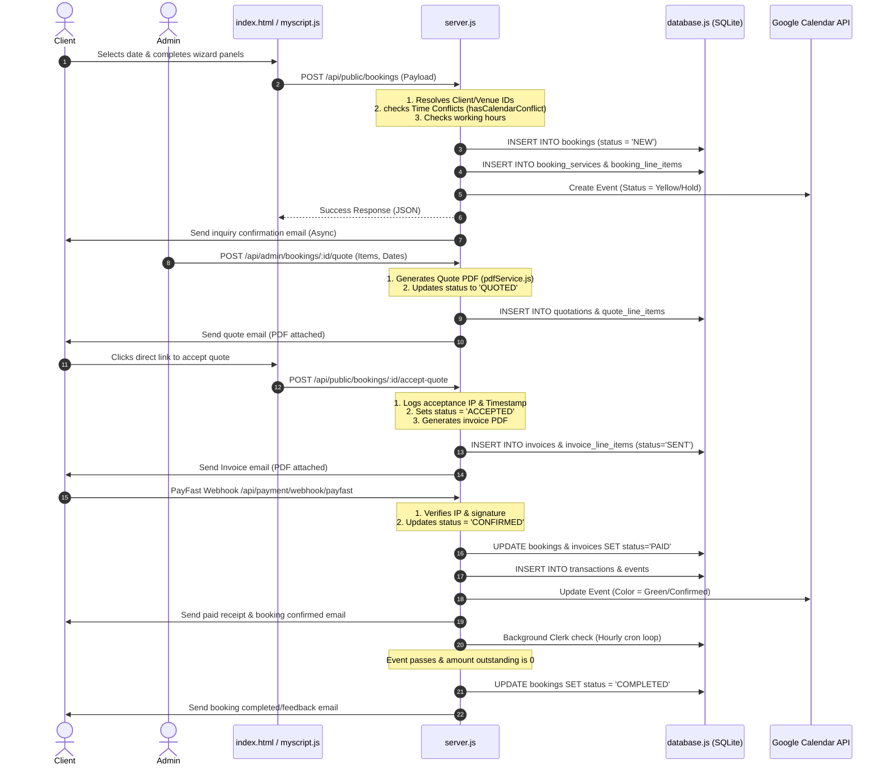

# Chat Conversation

Note: _This is purely the output of the chat conversation and does not contain any raw data, codebase snippets, etc. used to generate the output._

### User Input

### Planner Response

I will start by listing the directory structure to locate the files related to the booking system in your project. Let's see what files we have in the workspace.

*Listed directory [Thabiso Mhlongo Offcial Website](file:///c:/Users/muzim/OneDrive/Muzi%27s%20Office/Dev-Beast/Thabiso%20Mhlongo%20Official%20Website/Thabiso%20Mhlongo%20Offcial%20Website) *

### Planner Response

I will now list the contents of the `js/` directory to see what client-side JavaScript files are present, which are likely involved in handling the frontend of the booking system.

*Listed directory [js](file:///c:/Users/muzim/OneDrive/Muzi%27s%20Office/Dev-Beast/Thabiso%20Mhlongo%20Official%20Website/Thabiso%20Mhlongo%20Offcial%20Website/js) *

### Planner Response

I will search for occurrences of the word "book" or "booking" in the workspace to see where the booking flows are referenced, initiated, stored, or processed.

*Grep searched codebase*

### Planner Response

I see there are analytical files in the `TBC/` subdirectory, specifically `booking_process_analysis.md` and `booking_process_audit_report.md`. I will read `booking_process_analysis.md` first to see if it documents the phases of the booking system.

*Viewed [booking_process_analysis.md](file:///c:/Users/muzim/OneDrive/Muzi%27s%20Office/Dev-Beast/Thabiso%20Mhlongo%20Official%20Website/Thabiso%20Mhlongo%20Offcial%20Website/TBC/booking_process_analysis.md) *

### Planner Response

I will also read `TBC/booking_process_audit_report.md` to make sure we don't miss any other parts, phases, or components documented there.

*Viewed [booking_process_audit_report.md](file:///c:/Users/muzim/OneDrive/Muzi%27s%20Office/Dev-Beast/Thabiso%20Mhlongo%20Official%20Website/Thabiso%20Mhlongo%20Offcial%20Website/TBC/booking_process_audit_report.md) *

### Planner Response

I will search `database.js` for table definitions to see exactly how bookings, transactions, and client/venue relations are structured in the SQLite database.

*Grep searched codebase*

### Planner Response

I will view the beginning of `database.js` to see the SQLite schema definition and how the booking data model is structured.

*Viewed [database.js](file:///c:/Users/muzim/OneDrive/Muzi%27s%20Office/Dev-Beast/Thabiso%20Mhlongo%20Official%20Website/Thabiso%20Mhlongo%20Offcial%20Website/database.js) *

### Planner Response

I will search `server.js` to see the public booking submission handler and trace how incoming requests are processed.

*Grep searched codebase*

### Planner Response

I will search for any route containing `bookings` in `server.js` to understand the routes structure.

*Grep searched codebase*

### Planner Response

I will search `server.js` for occurrences of the word `post` to see if routes are defined using Express (`app.post` or `router.post`).

*Grep searched codebase*

### Planner Response

I will view the first 100 lines of `server.js` directly using `view_file` to see how it's structured and check why the grep search didn't return results.

*Viewed [server.js](file:///c:/Users/muzim/OneDrive/Muzi%27s%20Office/Dev-Beast/Thabiso%20Mhlongo%20Official%20Website/Thabiso%20Mhlongo%20Offcial%20Website/server.js) *

### Planner Response

I will view a section of `database.js` around the invoice definitions to verify the table structures for invoices, transactions, and ledger entries.

*Viewed [database.js](file:///c:/Users/muzim/OneDrive/Muzi%27s%20Office/Dev-Beast/Thabiso%20Mhlongo%20Official%20Website/Thabiso%20Mhlongo%20Offcial%20Website/database.js) *

### Planner Response

Based on a thorough review of the codebase, schemas, and design documents in your workspace, here is a consolidated technical breakdown of your booking system, from frontend wizard interfaces to backend APIs, database relations, and integrations.

---

### 1. Booking System Architecture & Sequence Flow

The diagram below illustrates how client interactions propagate through the frontend, API server, database tables, and external integrations across the entire lifecycle:

---

### 2. The 5 Phases of the Booking Lifecycle

A booking moves through five distinct statuses, each triggering specific system modifications:

#### Phase 1: Inquiry & Conflict Resolution (`NEW`)
*   **Action**: A client submits a booking request via the public wizard.
*   **Rules**:
    *   System checks calendar holds (`date_holds`), existing bookings, and Google Calendar for conflicts using `hasCalendarConflict`.
    *   Validates working hours (`working_hours`) and booking lead times.
    *   Creates a new record in `bookings` (status set to `NEW`).
    *   Syncs a temporary hold to Google Calendar (status=Yellow/Hold).

#### Phase 2: Quote Generation (`QUOTED`)
*   **Action**: Admin reviews the booking details and builds a quote.
*   **Rules**:
    *   Admin specifies line items, descriptions, and quote validity.
    *   `pdfService.js` creates a branded quotation PDF.
    *   Inserts record into `quotations` and updates the booking status to `QUOTED`.
    *   Dispatches an automated email to the client with the PDF quotation attachment.

#### Phase 3: Acceptance & Invoice Generation (`ACCEPTED`)
*   **Action**: Client clicks the signature link in the email to accept the quote.
*   **Rules**:
    *   Acceptance logs the client's IP, User-Agent, and timestamp into `consent_audit`.
    *   Booking status changes to `ACCEPTED`.
    *   System generates an official Invoice PDF and records it in `invoices` with status `SENT`.
    *   Dispatches the invoice via email to the client.

#### Phase 4: Payment & Event Confirmation (`CONFIRMED`)
*   **Action**: Client pays the invoice (minimum 50% deposit) via PayFast or a manual ledger transaction recorded by the admin.
*   **Rules**:
    *   PayFast webhook triggers processing or admin updates the transaction ledger.
    *   Updates booking and invoice records to `PAID` (or partially paid/confirmed).
    *   Updates the Google Calendar event to `[CONFIRMED]` (color code updates to Green/Confirmed).
    *   Inserts the event into `events` (public comedy tour calendar).
    *   Dispatches a booking confirmation email and transaction receipt.

#### Phase 5: Event Completion (`COMPLETED`)
*   **Action**: The background clerk checks for historical dates that are fully paid.
*   **Rules**:
    *   An hourly background checker loops through active bookings.
    *   If the event date has passed and `amount_outstanding` is `0`, status changes to `COMPLETED`.
    *   Sends a follow-up feedback email requesting review.

---

### 3. Frontend Architecture & Components

The client-facing UI features a progression framework split across key static pages and script bundles:

*   **Public Booking Wizard**: Integrated directly into [index.html](file:///c:/Users/muzim/OneDrive/Muzi's%20Office/Dev-Beast/Thabiso%20Mhlongo%20Official%20Website/Thabiso%20Mhlongo%20Offcial%20Website/index.html) and styled in modern Obsidian gold accent themes. It proceeds through 5 dynamic panels:
    *   **Panel 0 (Date Selection)**: Interactive datepicker. Triggers `/api/public/availability` to load open slots.
    *   **Panel 1 (Event Details)**: Populates public services from `/api/public/services`. Clients select desired acts, dynamically updating time slot availability based on setup buffers.
    *   **Panel 2 (Contact Details)**: Captures name, email, cell number, company, and tax settings.
    *   **Panel 3 (Location & Logistics)**: Google Places API autocompletes venue coordinates, address, travel/accommodation requirement toggles, and notes.
    *   **Panel 4 (Review & Submit)**: Summarizes inquiry details, accepts file attachments, gathers POPIA consent checkbox, and posts to `POST /api/public/bookings`.
*   **Core Frontend Script**: [js/myscript.js](file:///c:/Users/muzim/OneDrive/Muzi's%20Office/Dev-Beast/Thabiso%20Mhlongo%20Official%20Website/Thabiso%20Mhlongo%20Offcial%20Website/js/myscript.js) manages all state transitions, validators, Google Maps elements, and endpoints communication.
*   **Administrative Management Dashboard**: Managed within [admin.html](file:///c:/Users/muzim/OneDrive/Muzi's%20Office/Dev-Beast/Thabiso%20Mhlongo%20Official%20Website/Thabiso%20Mhlongo%20Offcial%20Website/admin.html), featuring calendars, booking pipelines, quote builders, role controls, and financial ledgers.

---

### 4. Backend Architecture & Components

The server-side execution environment is managed inside [server.js](file:///c:/Users/muzim/OneDrive/Muzi's%20Office/Dev-Beast/Thabiso%20Mhlongo%20Official%20Website/Thabiso%20Mhlongo%20Offcial%20Website/server.js):

*   **Conflict & Booking Evaluators**:
    *   `hasCalendarConflict(startTime, endTime)` checks `date_holds` holds, same-day conflicts in `bookings`, and Google Calendar API availability.
    *   `isWithinWorkingHours(dateStr, startHHMM, endHHMM)` verifies if the booking complies with rules configured in the database.
*   **Public Routing Layer**:
    *   `POST /api/public/bookings`: Main inquiry entry point.
    *   `POST /api/public/bookings/:id/attachments`: Uploads documents associated with a booking.
    *   `POST /api/public/bookings/:id/accept-quote`: Signs quote and triggers invoice generation.
*   **Admin Routing Layer**:
    *   `POST /api/admin/bookings`: Endpoint to manually construct bookings bypassing wizard checks.
    *   `POST /api/admin/bookings/:id/quote`: Archives old records and generates a new quote PDF via [js/pdfService.js](file:///c:/Users/muzim/OneDrive/Muzi's%20Office/Dev-Beast/Thabiso%20Mhlongo%20Official%20Website/Thabiso%20Mhlongo%20Offcial%20Website/js/pdfService.js).
    *   `POST /api/admin/transactions/manual`: Manually flags incoming payments, synchronizing GCal statuses and invoices.
*   **Automation Loop (`startBackgroundClerk`)**:
    *   Monitors holds cleanup: prunes Google Calendar sync entries that were deleted on the primary calendar.
    *   Manages event status updates from `CONFIRMED` to `COMPLETED` when dates elapse.

---

### 5. Database Schema & Core Tables

The system's data model is defined in [database.js](file:///c:/Users/muzim/OneDrive/Muzi's%20Office/Dev-Beast/Thabiso%20Mhlongo%20Official%20Website/Thabiso%20Mhlongo%20Offcial%20Website/database.js):

| Table Name | Primary Purpose | Key Fields & Relations |
| :--- | :--- | :--- |
| `bookings` | Core records of all comedy shows and inquiries | `id`, `status` (`NEW`, `PENDING`, `QUOTED`, `ACCEPTED`, `CONFIRMED`, `COMPLETED`, `CANCELLED`), `total_amount`, `amount_paid`, `amount_outstanding` |
| `clients` | Client record registry to prevent duplicate profile inputs | `id`, `full_name`, `email` (unique index), `company_name`, `tax_id` |
| `venues` | Geographical locations and coordinates metadata | `id`, `place_id` (Google Places link), `latitude`, `longitude`, `negotiated_rates` |
| `services` | Master pricing sheet and duration settings for comedy acts | `id`, `name`, `default_price`, `setup_time_minutes`, `performance_length_minutes`, `booking_lead_time_days` |
| `booking_services` | Links which catalog services have been selected for a show | `booking_id`, `service_id`, `quantity_minutes`, `total_price` |
| `date_holds` | Temporal constraints that prevent schedule overlaps | `id`, `hold_date`, `hold_expires_at`, `block_type` (e.g. `calendar_sync`) |
| `quotations` | Issued estimates that can be accepted by the client | `id`, `booking_id`, `quote_number`, `total_amount`, `status` |
| `invoices` | Official payment requests | `id`, `booking_id`, `invoice_number`, `total_amount`, `status` |
| `transactions` | Recorded entries of digital payments or ledger adjustments | `id`, `booking_id`, `invoice_id`, `amount`, `pf_payment_id` |

---

### 6. Key External Integrations

*   **Google Calendar API**:
    *   Creates a temporary hold slot during Phase 1 (`status = 'NEW'`).
    *   Modifies descriptions, durations, and upgrades event categories (changes color code and sets title prefix to `[CONFIRMED]`) on full payment.
    *   Removes event holds immediately if the booking is rejected or cancelled.
*   **PayFast Payment Gateway**:
    *   Receives payment actions.
    *   Webhook path `/api/payment/webhook/payfast` processes ITN validations, verifies MD5 signature hashes, and checks for transaction duplicates before flagging invoices.
*   **Mail SMTP Service**:
    *   Driven by [js/emailService.js](file:///c:/Users/muzim/OneDrive/Muzi's%20Office/Dev-Beast/Thabiso%20Mhlongo%20Official%20Website/Thabiso%20Mhlongo%20Offcial%20Website/js/emailService.js) and [js/emailTemplates.js](file:///c:/Users/muzim/OneDrive/Muzi's%20Office/Dev-Beast/Thabiso%20Mhlongo%20Official%20Website/Thabiso%20Mhlongo%20Offcial%20Website/js/emailTemplates.js).
    *   Asynchronously routes emails to client addresses for confirmations, quotes, invoices, payment receipts, and event reviews.