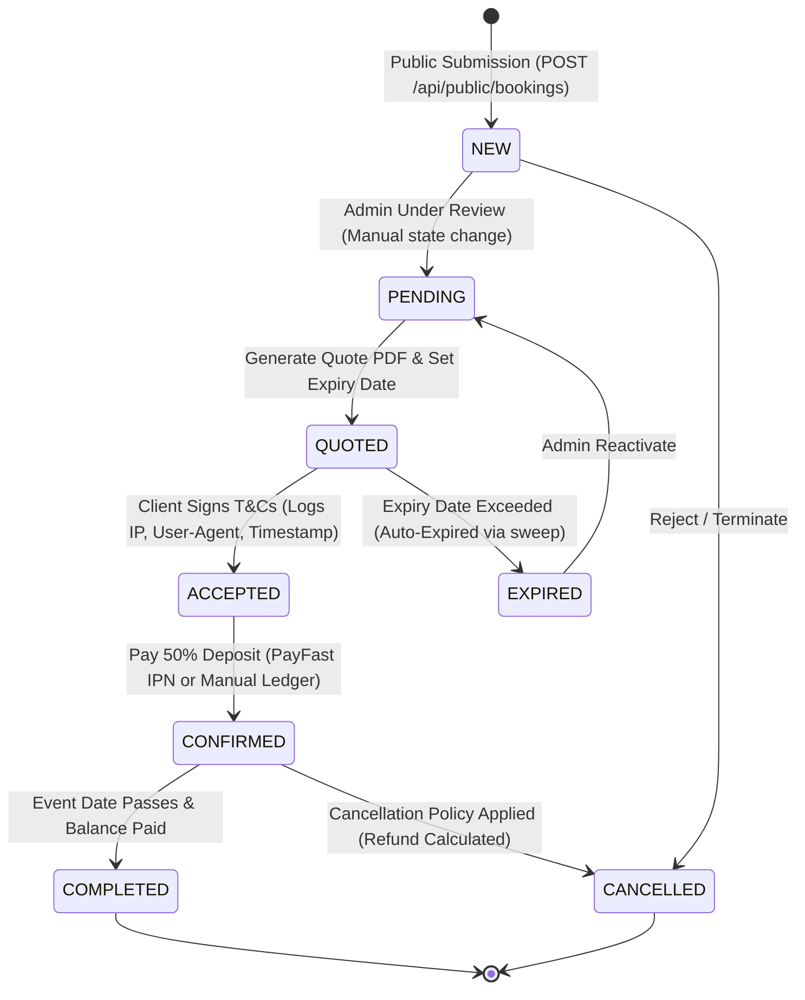

# Comprehensive End-to-End Booking System Audit & Gap Analysis

This document presents a rigorous, deep technical, functional, and security analysis of the public booking wizard, backend API handlers, database schema, and administrative flows.

---

## 1. End-to-End Booking Lifecycle Architecture

### A. Public Booking Wizard (Frontend Workflow)
The public wizard resides in [index.html](file:///c:/Users/muzim/OneDrive/Muzi's%20Office/Dev-Beast/Thabiso%20Mhlongo%20Official%20Website/Thabiso%20Mhlongo%20Offcial%20Website/index.html) and [js/myscript.js](file:///c:/Users/muzim/OneDrive/Muzi's%20Office/Dev-Beast/Thabiso%20Mhlongo%20Official%20Website/Thabiso%20Mhlongo%20Offcial%20Website/js/myscript.js). It executes in five progressive panels:
- **Panel 0 — Date Selection**: Renders a calendar view. Selecting a date triggers `/api/public/availability?date=...` and queries working hours via `/api/public/booking-config?dow=X` to retrieve busy/open intervals.
- **Panel 1 — Event Details**: Collects event name, event type, and dynamically queries the public services catalogue (`/api/public/services`). Users can add services from a dropdown. It renders a time-slot grid based on selected service durations.
- **Panel 2 — Contact Details**: Gathers name, email, cell number, company, and optional VAT number.
- **Panel 3 — Location & Logistics**: Google Places autocomplete input captures address, city, country, and venue type. Gathers budget range, travel accommodation toggles, and detailed notes.
- **Panel 4 — Review & Submit**: Summarizes the inputs, allows the client to drag/drop files to upload, prompts for POPIA consent, and sends payload to `POST /api/public/bookings`. After success, it uploads attachments via `POST /api/public/bookings/:id/attachments`.

### B. Backend Endpoint & Processing (API Flow)
- **Validation**: Enforces basic format validation (email structure, cell digits, POPIA consent, and message/notes lengths).
- **Client & Venue Resolution**: Calls `findOrCreateClient` and `findOrCreateVenueFromPlace` in [server.js](file:///c:/Users/muzim/OneDrive/Muzi's%20Office/Dev-Beast/Thabiso%20Mhlongo%20Official%20Website/Thabiso%20Mhlongo%20Offcial%20Website/server.js) to avoid duplicate records and link to relational database IDs.
- **Conflict Calculation**: Compares the show start/end times (including setup times and `min_booking_gap_minutes` buffer) against existing bookings and holds using `hasCalendarConflict`.
- **Database Write**: Runs a `BEGIN IMMEDIATE` transaction to save the core booking entry, followed by multiple inserts in `booking_services` and `booking_line_items`.
- **Integrations**: Syncs the booking data to Google Calendar (using a credentials fallback if tokens expire) and calls `sendBookingReceivedEmail` to dispatch notifications.

---

## 2. Critical Technical & Functional Gaps

### Gap 1 — Duplicate Gating Mismatch (Frontend blocks same-day multi-bookings) ⚠️ CRITICAL
- **File References**: [js/myscript.js:1982](file:///c:/Users/muzim/OneDrive/Muzi's%20Office/Dev-Beast/Thabiso%20Mhlongo%20Official%20Website/Thabiso%20Mhlongo%20Offcial%20Website/js/myscript.js#L1982), [server.js:6521](file:///c:/Users/muzim/OneDrive/Muzi's%20Office/Dev-Beast/Thabiso%20Mhlongo%20Official%20Website/Thabiso%20Mhlongo%20Offcial%20Website/server.js#L6521)
- **Technical Detail**: The backend was successfully updated to permit multiple same-day bookings for the same client (validating only that the time slots do not overlap). However, the client-side code still calls `GET /api/public/check-duplicate?date=...&email=...` before submission. This endpoint queries:
  `SELECT id FROM bookings WHERE LOWER(email)=LOWER(?) AND date=? AND status NOT IN ('CANCELLED','EXPIRED')`
  If any row is returned, the frontend triggers `window.notificationService.showWarning` and **completely halts wizard progression**, preventing the user from submitting a second booking on the same day.
- **Remediation**: Remove the duplicate email/date gating check on the client-side wizard, or update the API endpoint to validate time ranges instead of purely dates.

### Gap 2 — Server Timezone Offset Vulnerability ⚠️ CRITICAL
- **File References**: [server.js](file:///c:/Users/muzim/OneDrive/Muzi's%20Office/Dev-Beast/Thabiso%20Mhlongo%20Official%20Website/Thabiso%20Mhlongo%20Offcial%20Website/server.js) (lines 581, 893, 2375, 5821)
- **Technical Detail**: The server parses date/time combinations using `moment(\`${date} ${time}\`).toISOString()`. If the hosting provider's host operating system runs on UTC (standard for cloud platforms), `moment` parses local times like `"10:00"` as `"10:00 UTC"`. The resulting string `2026-06-15T10:00:00.000Z` corresponds to `12:00` South African Standard Time (SAST, UTC+2), introducing a 2-hour delay. This shifts calendar availability slots and Google Calendar sync dates.
- **Remediation**: Set the default timezone globally in [server.js](file:///c:/Users/muzim/OneDrive/Muzi's%20Office/Dev-Beast/Thabiso%20Mhlongo%20Official%20Website/Thabiso%20Mhlongo%20Offcial%20Website/server.js) right after importing `moment-timezone`:
  `moment.tz.setDefault('Africa/Johannesburg');`
  This ensures all timezone-agnostic `moment` calls throughout the backend process dates relative to Johannesburg local time.

### Gap 3 — Substring UTC Time Parsing Conflict in Overlap Checks ⚠️ CRITICAL
- **File References**: [server.js:478-479](file:///c:/Users/muzim/OneDrive/Muzi's%20Office/Dev-Beast/Thabiso%20Mhlongo%20Official%20Website/Thabiso%20Mhlongo%20Offcial%20Website/server.js#L478-479)
- **Technical Detail**: In `hasCalendarConflict`, the requested times are extracted using substring matches on ISO strings:
  `const reqStart = startTime.substring(11, 16);`
  If the default timezone is set to Johannesburg (UTC+2), `startTime` gets parsed as `2026-06-15T08:00:00.000Z` (representing 10:00 SAST). `reqStart` then extracts `"08:00"`. However, the local database stores `event_start_time` as `"10:00"`. When `reqStart` (`"08:00"`) is compared directly against the DB's `event_start_time` (`"10:00"`), they fail to overlap, permitting double-bookings.
- **Remediation**: Extract times relative to local timezone using moment formatting:
  `const reqStart = moment(startTime).tz('Africa/Johannesburg').format('HH:mm');`
  `const reqEnd   = moment(endTime).tz('Africa/Johannesburg').format('HH:mm');`

### Gap 4 — Nested Timer CPU/Memory Leak in `startBackgroundClerk` ⚠️ CRITICAL
- **File References**: [server.js:1015](file:///c:/Users/muzim/OneDrive/Muzi's%20Office/Dev-Beast/Thabiso%20Mhlongo%20Official%20Website/Thabiso%20Mhlongo%20Offcial%20Website/server.js#L1015)
- **Technical Detail**: In `startBackgroundClerk`, there is an hourly interval loop (`setInterval(..., 3600000)`). Inside this loop, the following code is executed:
  `setInterval(syncCalendarHolds, 15 * 60 * 1000);`
  Every hour, the background clerk spawns a *new* nested timer. Over days of operation, hundreds of duplicate timers will run concurrently, leading to CPU exhaustion, memory leaks, and severe Google API rate limiting blockages.
- **Remediation**: Move the calendar sync timer instantiation out of the hourly interval loop so it is only registered once at startup.

### Gap 5 — Google Calendar Sync Hold Expirations ⚠️ CRITICAL
- **File References**: [server.js:688-695](file:///c:/Users/muzim/OneDrive/Muzi's%20Office/Dev-Beast/Thabiso%20Mhlongo%20Official%20Website/Thabiso%20Mhlongo%20Offcial%20Website/server.js#L688-695)
- **Technical Detail**: When Google Calendar events are synced into the local database as `date_holds`, they are assigned a hardcoded 7-day expiry date in `hold_expires_at`. Once 7 days elapse, the database queries in `checkDateAvailability` ignore the hold because the expiry is in the past:
  `AND (hold_expires_at IS NULL OR hold_expires_at > datetime('now'))`
  However, the synced event is still active in Google Calendar! This allows users to double-book active calendar events. In addition, if a calendar hold is deleted or moved on Google Calendar, the local hold is never updated or removed, leaving duplicate/stale holds.
- **Remediation**: 
  - Remove the 7-day expiry limit for synchronized calendar holds (set `hold_expires_at` to `NULL` for `calendar_sync` types).
  - Modify `syncCalendarHolds` to query currently active holds and automatically delete any local holds that are no longer returned by the Google Calendar list API.

### Gap 6 — Blocking SMTP connection handshakes on request thread
- **File References**: [server.js:2484](file:///c:/Users/muzim/OneDrive/Muzi's%20Office/Dev-Beast/Thabiso%20Mhlongo%20Official%20Website/Thabiso%20Mhlongo%20Offcial%20Website/server.js#L2484)
- **Technical Detail**: During public submissions, `POST /api/public/bookings` awaits `sendBookingReceivedEmail` before returning an HTTP response. The client must wait for SMTP socket connections and handshakes, causing the submit spinner to hang for up to 15 seconds.
- **Remediation**: Dispatch email notifications asynchronously (fire-and-forget or offloaded to a worker queue) and immediately return the successful JSON response to the user.

### Gap 7 — Narrow Double-Click Submission Window
- **File References**: [js/myscript.js:1954](file:///c:/Users/muzim/OneDrive/Muzi's%20Office/Dev-Beast/Thabiso%20Mhlongo%20Official%20Website/Thabiso%20Mhlongo%20Offcial%20Website/js/myscript.js#L1954)
- **Technical Detail**: The submission state `isSubmitting = true` is set, but the actual submit button is disabled asynchronously. Fast double-clicks bypass this protection and send duplicate bookings.
- **Remediation**: Disable the submit button synchronously on the very first line of the click handler callback.

---

## 3. Security, Compliance & Data Validation Audit

### A. POPIA Consent Version Auditing
- **The Issue**: Consents are saved with `popia_consent = 1` and a timestamp, but the exact version of the Privacy Policy shown is not recorded. If the policy changes, historical consent terms cannot be legally verified.
- **The Solution**: Store the active policy version identifier (e.g. `policy_version = 'v2.1'`) alongside the consent record in `bookings` and `newsletter_subscribers` tables.

### B. Rate Limiting Countdown Toast
- **The Issue**: When rate-limited (429), the server returns `{ success: false, message: 'Too many submissions...' }`. The client displays a generic error message and does not inform the user how long they must wait.
- **The Solution**: Read the `Retry-After` header in the frontend fetch interceptor and display a remaining countdown timer.

---

## 4. UI Branding & Accessibility Audit (WCAG 2.2 AA)

### A. Editorial-Luxe Theme Conformance
- **Palette**: The color scheme matches the strict guidelines: Obsidian background (`#0a0a0a`), dark cards (`#1a1a1a`), and gold accents (`#D4AF37`/`#E8C14B`).
- **Typography**: Headings correctly reference `'Cormorant Garamond'` and body copy correctly uses `'Outfit'`.

### B. Accessibility Gaps (WCAG 2.2 AA Level AA)
- **Touch Target Sizes**: On mobile, the service remove buttons (`.bk-svc-remove`) and modal close buttons (`.close`) drop below 44x44px.
- **Live Region Announcements**: When time-slot grids are filtered or updated, assistive technology does not read the slot changes. An `aria-live="polite"` container should announce updating availability.
- **Contrast Ratios**: The grey text on disabled time slots (`#444`/`#555` on `#1a1a1a`) fails the 3:1 contrast ratio required for graphical components and state indicators. A tool-tip or `aria-disabled="true"` label should be explicitly appended for accessibility compliance.

---

## 5. Visual Specs for Mobile-First Redesign (Editorial-Luxe)

| Token | Rule / Value | Description |
|---|---|---|
| **Background Color** | `#0a0a0a` | Absolute obsidian background for body and sections |
| **Surface Card Bg** | `#1a1a1a` | Secondary dark color for panels, cards, and dropdown containers |
| **Primary Gold Accent** | `#D4AF37` | Main brand gold for focus outlines, primary buttons, and selected states |
| **Gold Hover State** | `#E8C14B` | Lighter brand gold for interactive hover states |
| **Typography (Headings)**| `'Cormorant Garamond', serif` | Sophisticated serif with elegant tracking and line height |
| **Typography (Body)** | `'Outfit', sans-serif` | Clean, geometric sans-serif for legible reading |
| **Typography (Mono)** | `'JetBrains Mono', monospace` | Used exclusively for booking reference IDs and codes |
| **Touch Target Area** | Min `44px` height and width | Applied to all interactive buttons, inputs, and close icons |
| **Active Focus Rings** | `2px solid #D4AF37` offset `2px` | High visibility keyboard focus state for all input elements |

---

## 6. Summary Matrix of Findings

| Finding | Severity | Target File(s) | Remediation Impact |
|---|---|---|---|
| Duplicate Gating Blocks Same-Day Multi-Bookings | 🔴 Critical | [myscript.js](file:///c:/Users/muzim/OneDrive/Muzi's%20Office/Dev-Beast/Thabiso%20Mhlongo%20Official%20Website/Thabiso%20Mhlongo%20Offcial%20Website/js/myscript.js) | Restores multi-booking capability for corporate/repeat users |
| Timezone parsing shifts calendar slots by 2 hours on UTC servers | 🔴 Critical | [server.js](file:///c:/Users/muzim/OneDrive/Muzi's%20Office/Dev-Beast/Thabiso%20Mhlongo%20Official%20Website/Thabiso%20Mhlongo%20Offcial%20Website/server.js) | Corrects GCal and database scheduling alignment |
| Substring UTC Time Parsing in `hasCalendarConflict` fails to match local hours | 🔴 Critical | [server.js](file:///c:/Users/muzim/OneDrive/Muzi's%20Office/Dev-Beast/Thabiso%20Mhlongo%20Official%20Website/Thabiso%20Mhlongo%20Offcial%20Website/server.js) | Prevents scheduling overlaps on time-slot comparisons |
| Nested `setInterval` resource leak in background clerk | 🔴 Critical | [server.js](file:///c:/Users/muzim/OneDrive/Muzi's%20Office/Dev-Beast/Thabiso%20Mhlongo%20Official%20Website/Thabiso%20Mhlongo%20Offcial%20Website/server.js) | Eliminates CPU/Memory exhaustion and API rate limiting blocks |
| Google Calendar Sync Holds Expire & Lack Cleanup | 🔴 Critical | [server.js](file:///c:/Users/muzim/OneDrive/Muzi's%20Office/Dev-Beast/Thabiso%20Mhlongo%20Official%20Website/Thabiso%20Mhlongo%20Offcial%20Website/server.js) | Prevents double bookings and ensures calendar stays clean |
| SMTP connection handshakes block HTTP request thread | 🟡 Medium | [server.js](file:///c:/Users/muzim/OneDrive/Muzi's%20Office/Dev-Beast/Thabiso%20Mhlongo%20Official%20Website/Thabiso%20Mhlongo%20Offcial%20Website/server.js) | Trims response wait time from ~15s to sub-seconds |
| Submission wizard vulnerable to duplicate double-clicks | 🟡 Medium | [myscript.js](file:///c:/Users/muzim/OneDrive/Muzi's%20Office/Dev-Beast/Thabiso%20Mhlongo%20Official%20Website/Thabiso%20Mhlongo%20Offcial%20Website/js/myscript.js) | Prevents race condition submissions from same device |
| Disabled slot contrast fails WCAG 4.5:1 / 3:1 criteria | 🟢 Low | [redesign.css](file:///c:/Users/muzim/OneDrive/Muzi's%20Office/Dev-Beast/Thabiso%20Mhlongo%20Official%20Website/Thabiso%20Mhlongo%20Offcial%20Website/css/redesign.css) | Restores visibility for low-vision users |
| Missing policy version auditing for POPIA compliance | 🟢 Low | [database.js](file:///c:/Users/muzim/OneDrive/Muzi's%20Office/Dev-Beast/Thabiso%20Mhlongo%20Official%20Website/Thabiso%20Mhlongo%20Offcial%20Website/database.js), [server.js](file:///c:/Users/muzim/OneDrive/Muzi's%20Office/Dev-Beast/Thabiso%20Mhlongo%20Official%20Website/Thabiso%20Mhlongo%20Offcial%20Website/server.js) | Secures immutable compliance audit tracking |
