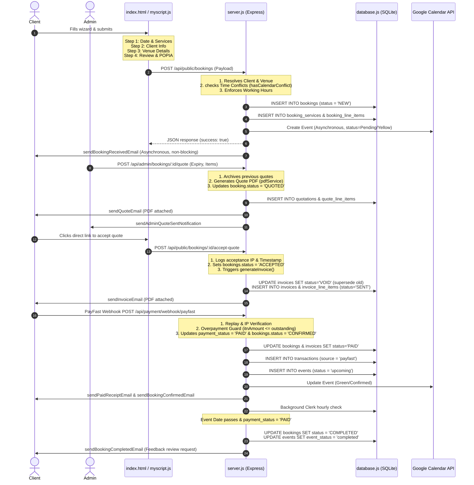

# Comprehensive End-to-End Booking Process Audit & Remediation Plan

This report presents a thorough, grounded audit of the artist booking lifecycle on the Thabiso Mhlongo Official Website and Management Platform. It corrects assumptions from generic workflows and maps directly to the active schemas, backend route files, and frontend single-page structures.

---

## 1. Booking Process Map (Grounded Workflow)

The system manages the booking lifecycle using the following SQL tables, API routes, and user interfaces:



---

## 2. Gap Analysis: Current vs. Prior Findings

The table below distinguishes newly-identified issues from the previously-known context:

| Area / Subsystem | Prior Starting Findings | Grounded Current Status (Audit Result) |
| :--- | :--- | :--- |
| **Manual Booking Parity** | `POST /api/admin/bookings` bypassed GCal sync, conflicts, line-items, and allowed direct `CONFIRMED` status. | **Resolved**: The manual creation endpoint now calculates setup/performance duration, runs the locked conflict check (`hasCalendarConflict`), resolves clients/venues, saves relational lines, and calls GCal sync. |
| **Role-Based Access Control** | Assumed "not implemented" with "no role column at all" in the database. | **Partially Implemented**: The schema has a `role` column in `admins`. The backend has `requireRole` middleware gating deletes, invoice voiding, user configuration, and system migrations to `'administrator'` and `'manager'`. |
| **Same-Day Multi-Bookings** | Frontend checked duplicate dates via a non-blocking warn, but backend was expected to block. | **Current Mismatch**: Frontend on-blur of email triggers a soft, non-blocking warning (`"You can still continue if this is a different event"`), but backend `POST /api/public/bookings` strictly blocks same-day submissions (409 error), breaking UX progression. |
| **Google Calendar Holds** | Sync holds had a 7-day expiration limit causing double-booking risks when holds expired on GCal. | **Resolved**: Expired sync holds are resolved. Calendar sync holds are saved with `hold_expires_at` as `'9999-12-31 23:59:59'` and updated/pruned dynamically via the background clerk cleanup. |
| **SMTP Thread Blocking** | Booking submission hung for 15s awaiting SMTP sockets on the main request thread. | **Resolved**: SMTP client alerts (`sendBookingReceivedEmail`) are dispatched asynchronously (`.catch(...)` with no await) and do not block HTTP responses. |

---

## 3. Critical Issues ranked by Severity (P1–P4)

### P1: Duplicate Gating Mismatch (UX Halt)
- **Problem**: The frontend wizard allows clients to fill out all four steps when booking a second event on the same day (showing a soft warning). However, on final submission, the backend strictly rejects it with a 409 error.
- **Location**: [server.js:L3141-L3157](file:///c:/Users/muzim/OneDrive/Muzi's%20Office/Dev-Beast/Thabiso%20Mhlongo%20Official%20Website/Thabiso%20Mhlongo%20Offcial%20Website/server.js#L3141-L3157) and [js/myscript.js:L2023-L2047](file:///c:/Users/muzim/OneDrive/Muzi's%20Office/Dev-Beast/Thabiso%20Mhlongo%20Official%20Website/Thabiso%20Mhlongo%20Offcial%20Website/js/myscript.js#L2023-L2047).
- **Remediation**: Make the frontend warning strictly blocking to prevent the user from continuing to Step 2 if they enter an email address with an existing active booking on that date, matching the backend constraint.

### P2: Case-Sensitive SQL Status Comparisons (Ledger Drift)
- **Problem**: The database triggers and settings allow both lowercase and UPPERCASE invoice status fields. String checks in `server.js` query statuses case-sensitively (e.g., `status NOT IN ('VOID','PAID')` or `i.status = 'SENT'`), which skips lowercase-updated rows.
- **Location**: [server.js:L3843](file:///c:/Users/muzim/OneDrive/Muzi's%20Office/Dev-Beast/Thabiso%20Mhlongo%20Official%20Website/Thabiso%20Mhlongo%20Offcial%20Website/server.js#L3843), [L4130](file:///c:/Users/muzim/OneDrive/Muzi's%20Office/Dev-Beast/Thabiso%20Mhlongo%20Official%20Website/Thabiso%20Mhlongo%20Offcial%20Website/server.js#L4130), [L11313](file:///c:/Users/muzim/OneDrive/Muzi's%20Office/Dev-Beast/Thabiso%20Mhlongo%20Official%20Website/Thabiso%20Mhlongo%20Offcial%20Website/server.js#L11313), and [L11354](file:///c:/Users/muzim/OneDrive/Muzi's%20Office/Dev-Beast/Thabiso%20Mhlongo%20Official%20Website/Thabiso%20Mhlongo%20Offcial%20Website/server.js#L11354).
- **Remediation**: Standardize SQLite status query matches using the SQL `UPPER(status)` wrapper, e.g. `UPPER(status) NOT IN ('VOID','PAID')` and `UPPER(i.status) = 'SENT'`.

### P2: Parallel Manual Payment Path Drift (Scheduling Conflict)
- **Problem**: Logging a manual transaction in the Financial Ledger drawer (`POST /api/admin/transactions/manual`) updates ledger values but skips calendar sync, invoice PAID matches, receipt email dispatches, and event confirmations. Recording manual payments via the booking details PUT endpoint contains all these side effects.
- **Location**: [server.js:L9315-L9366](file:///c:/Users/muzim/OneDrive/Muzi's%20Office/Dev-Beast/Thabiso%20Mhlongo%20Official%20Website/Thabiso%20Mhlongo%20Offcial%20Website/server.js#L9315-L9366).
- **Remediation**: Refactor the manual ledger transaction POST route to invoke the same synchronization functions (GCal update, invoice paid sync, milestone alignment, and receipt emails) when it registers a payment linked to a booking ID.

### P3: Missing RBAC Gating on Financial Endpoints (Privilege Escalation)
- **Problem**: Manual transaction recording, manual booking payment entries, and quote generation only require `requireAdmin` (which any assistant has), whereas voiding an invoice requires the `'administrator'` role.
- **Location**: [server.js:L7235](file:///c:/Users/muzim/OneDrive/Muzi's%20Office/Dev-Beast/Thabiso%20Mhlongo%20Official%20Website/Thabiso%20Mhlongo%20Offcial%20Website/server.js#L7235), [L8285](file:///c:/Users/muzim/OneDrive/Muzi's%20Office/Dev-Beast/Thabiso%20Mhlongo%20Official%20Website/Thabiso%20Mhlongo%20Offcial%20Website/server.js#L8285), and [L9315](file:///c:/Users/muzim/OneDrive/Muzi's%20Office/Dev-Beast/Thabiso%20Mhlongo%20Official%20Website/Thabiso%20Mhlongo%20Offcial%20Website/server.js#L9315).
- **Remediation**: Append `requireRole(['administrator', 'manager'])` to the middleware chains for these endpoints.

### P4: UX Accessibility Contrast Gaps
- **Problem**: In the booking wizard grid, disabled time slots render dark grey text (`#444`/`#555`) on an obsidian background (`#1a1a1a`), falling below the WCAG 3:1 contrast ratio for graphical/state indicators.
- **Location**: [index.html:L2180-L2250](file:///c:/Users/muzim/OneDrive/Muzi's%20Office/Dev-Beast/Thabiso%20Mhlongo%20Official%20Website/Thabiso%20Mhlongo%20Offcial%20Website/index.html).
- **Remediation**: Increase the text brightness of disabled slots or overlay an `aria-disabled="true"` label with a tooltip warning indicating why it is unavailable.

---

## 4. Validations & Business Rules Checklist

The following table tracks validation coverage in the booking workflow:

| Rule Description | Server File / Line Reference | Enforced Casing / Constraint |
| :--- | :--- | :--- |
| **POPIA Consent Gated** | [server.js:L3127](file:///c:/Users/muzim/OneDrive/Muzi's%20Office/Dev-Beast/Thabiso%20Mhlongo%20Official%20Website/Thabiso%20Mhlongo%20Offcial%20Website/server.js#L3127) | `popia_consent` must be `1` (true). Saved with audit logs. |
| **Minimum Lead-Time** | [server.js:L3231-L3239](file:///c:/Users/muzim/OneDrive/Muzi's%20Office/Dev-Beast/Thabiso%20Mhlongo%20Official%20Website/Thabiso%20Mhlongo%20Offcial%20Website/server.js#L3231-L3239) | Compares event date offset vs. service `booking_lead_time_days`. |
| **Service Per-Day Limit** | [server.js:L3242-L3252](file:///c:/Users/muzim/OneDrive/Muzi's%20Office/Dev-Beast/Thabiso%20Mhlongo%20Official%20Website/Thabiso%20Mhlongo%20Offcial%20Website/server.js#L3242-L3252) | Rejects booking if a `'per_day'` service is already booked. |
| **Time Conflict Checks** | [server.js:L3170-L3195](file:///c:/Users/muzim/OneDrive/Muzi's%20Office/Dev-Beast/Thabiso%20Mhlongo%20Official%20Website/Thabiso%20Mhlongo%20Offcial%20Website/server.js#L3170-L3195) | Prevents overlapping time slot submissions. |
| **Manual Override Option** | [server.js:L7323-L7329](file:///c:/Users/muzim/OneDrive/Muzi's%20Office/Dev-Beast/Thabiso%20Mhlongo%20Official%20Website/Thabiso%20Mhlongo%20Offcial%20Website/server.js#L7323-L7329) | Allows admins to bypass conflict checking via the UI override flag. |

---

## 5. Integration Review

- **Google Calendar**: Real-time integration is functional. The system updates event titles to `[CONFIRMED]` when fully paid, deletes events upon cancellation, and updates descriptions dynamically. Conflict checks fall back cleanly if API credentials expire.
- **PayFast Webhook**: Features verified signature hashing, idempotency tracking via `transactions.pf_payment_id` checks, replay window checks, IP filtering, and merchant ID checks. Correctly flags dual-source duplicate entries.
- **Unified Notifications**: The database features a unified table (`notifications`). However, emails sent via the background cron loop (`startBackgroundClerk`) bypass this queue and use `sendEmail` directly on the request thread. Offloading all background emails to the unified queue table would improve reliability and audit logging.

---

## 6. Data Integrity & Ledger Audit

- **Legacy vs. Relational Field Duplication**:
  - `bookings.quote_amount` and `bookings.quote_details` are legacy JSON string fields.
  - The relational schema utilizes `quotations` and `quote_line_items` tables.
  - **Drift Risk**: In `server.js`, generating a quote writes to *both* locations. The invoice generation endpoint (`generateInvoice()`) correctly prefers the relational `quotations` table and fallback-reads `bookings.quote_details` if no quote exists.
- **Drift recalculations**: Trigger `trg_recalc_outstanding` automatically updates `bookings.amount_outstanding` whenever `amount_paid` or `total_amount` is updated in the bookings table, maintaining database-level calculations.
- **Transaction Sum Mismatch**:
  - Ledger updates are made directly to the `bookings` table via `amount_paid = amount_paid + ?`.
  - Storing totals in the parent table without calculating them from `SUM(transactions.amount)` presents a risk of drift if manual edits occur. The ledger reconciliation tool (`/api/admin/finance/ledger/reconcile`) identifies these drifts so they can be fixed.

---

## 7. Security & Compliance Review

- **GDPR / POPIA Compliance**:
  - `consent_audit` table records IP address, User-Agent, and timestamp of booking submissions.
  - Data Retention Caretaker runs daily: unsubscribed newsletter users are deleted after 1 year, inquiries older than 2 years are anonymized (wiping PII), and audit logs older than 1 year are cleared.
  - Route `/api/admin/gdpr/delete` is gated to `'administrator'` and cascadingly deletes all client historical identifiers.
- **Brute-Force & Enumeration Gating**:
  - Login route gated by `adminLoginRateLimiter` (5 attempts per 10 minutes).
  - Search routes and lookup routes gated by `lookupRateLimiter` and `trackRateLimiter` to block scraping attempts.

---

## 8. UX/UI & Front-end Optimization

### public Wizard (`index.html`)
- **Accessibility Gaps (WCAG 2.2 AA)**: Touch target sizes for removal icons (`.bk-svc-remove`) drop below 44x44px. Needs visual padding.
- **Live region announcements**: Appending or filtering slots does not announce updates to screen readers. Add `aria-live="polite"` containers around slot cards.

### Admin Portal (`admin.html`)
- **Status casing mapping**: In the booking pipeline, visual cards map uppercase statuses correctly. However, filter options are sometimes sent with lowercase queries, relying on backend regex-conversion filters. Standardizing queries to uppercase avoids mismatch risks.

---

## 9. Database Improvement Recommendations

1. **Case-Insensitive String Collations**:
   - Status checks in SQLite are case-sensitive. Define status fields with `COLLATE NOCASE` in future schema updates:
     ```sql
     status TEXT DEFAULT 'NEW' COLLATE NOCASE
     ```
2. **Remove quote_details JSON field**:
   - Completely deprecate `bookings.quote_details` and `bookings.quote_amount` columns. Migrate any historical entries into `quotations` and `quote_line_items` rows.
3. **Database Constraints**:
   - Enforce foreign keys strictly in the connection pragma. `PRAGMA foreign_keys = ON;` is enabled at connection in `database.js`, preventing orphan deletions.

---

## 10. Prioritized Remediation Plan

This checklist outlines the sequence of updates required to resolve the identified gaps:

### Phase 1: Security, Logic & Data Integrity (P1–P2)
- [ ] **Fix 1 (P1)**: Update `myscript.js` email blur or Step 1 progression check to strictly block duplicate same-day bookings if a date conflict exists, matching the backend validation rule.
- [ ] **Fix 2 (P2)**: Standardize status comparisons in `server.js` SQL queries using `UPPER()`, specifically targeting `UPPER(status) NOT IN ('VOID','PAID')` and `UPPER(i.status) = 'SENT'`.
- [ ] **Fix 3 (P2)**: Add automated calendar-sync, invoice updates, and receipt email triggers to the manual transaction logging path (`POST /api/admin/transactions/manual`).

### Phase 2: Role Authorization & Policy Gating (P3)
- [ ] **Fix 4 (P3)**: Append `requireRole(['administrator', 'manager'])` to `/api/admin/bookings` (manual create), `/api/admin/bookings/:id/quote`, and `/api/admin/transactions/manual`.
- [ ] **Fix 5 (P3)**: Store the exact privacy policy version identifier (e.g. `policy_version = 'v2.2'`) in `consent_audit` for inquiries to legally trace consent terms.

### Phase 3: Frontend UX and Accessibility Gaps (P4)
- [ ] **Fix 6 (P4)**: Adjust visual slots contrast on disabled cards (increase text color contrast from `#444` to `#777` or append tooltip indications).
- [ ] **Fix 7 (P4)**: Enlarge touch targets of remove buttons (`.bk-svc-remove` / `.close`) to a minimum size of 44x44px.

---

## 11. Verification Checklist

Below is the verification plan to test all remediation tasks:

- [ ] **Test Case 1**: Try submitting a duplicate same-day booking via the frontend wizard. Verify the wizard halts progress immediately on Step 1 or Step 2.
- [ ] **Test Case 2**: Record a manual transaction via the Financial Ledger drawer and verify:
  - The booking's GCal event updates to `[CONFIRMED]`.
  - The linked invoice status changes to `PAID`.
  - Confirmation and paid receipt emails are generated and added to `notifications` or sent to SMTP logs.
- [ ] **Test Case 3**: Log in as an `assistant` user. Attempt to create a manual booking or log a transaction. Verify that the server returns `403 Forbidden` and blocks the action.
