# Booking Workflow Analysis — Thabiso Mhlongo

## 1. Complete Booking Workflow Diagram

```mermaid
flowchart TD
    A([Client Visits Website]) --> B[Booking Enquiry Wizard\nindex.html - multi-step form]
    B --> B1{Draft auto-saved?}
    B1 -->|Yes| B2[Resume Abandoned Draft\n/api/public/bookings/draft/:token]
    B1 -->|No| B3[Submit New Booking\nPOST /api/public/bookings]
    B2 --> B3

    B3 --> C{Validation & Conflict Checks}
    C -->|Pass| D[(DB: bookings INSERT\nstatus = NEW)]
    C -->|Conflict| E[❌ Error — Client Selects Another Date]
    D --> F[📧 Client: Booking Received Email]
    D --> G[📅 Google Calendar Sync\nhold created]

    D --> H([Admin Reviews Booking\nadmin.html - Pipeline Tab])
    H --> H1{Admin Action}
    H1 -->|Mark Pending| I[status = PENDING\n📧 Under Review Email]
    H1 -->|Quote Directly| J

    I --> J[Admin Generates Quote\nPOST /api/admin/bookings/:id/quote]
    J --> J1[(DB: quotations INSERT\nstatus = sent)]
    J1 --> J2[🖨️ PDF Quote Generated]
    J2 --> J3[📧 Client: Quote Email + PDF]
    J3 --> J4[status = QUOTED]

    J4 --> K{Client Decision}
    K -->|Accept Quote| L[POST /api/public/bookings/:id/accept-quote\nstatus = ACCEPTED]
    K -->|Request Revision| M[📧 Admin: Revision Request]
    K -->|Ignore / Expire| N[⏱️ Quote Follow-Up Job\n24h auto-reminder]
    N --> K

    L --> L1[(quotations.status = accepted)]
    L1 --> L2[Auto: 50/50 Payment Schedule Created]
    L2 --> L3[📅 Calendar Updated — ACCEPTED status]
    L3 --> L4[🖨️ Invoice Auto-Generated\n+ 📧 Client: Invoice Email]

    L4 --> O([Contract Phase\n⚠️ MANUAL – Admin uploads PDF])
    O --> O1[Admin Uploads Contract\nPOST /api/admin/bookings/:id/contract]
    O1 --> O2{Contract Signed?}
    O2 -->|Admin signs| O3[PUT /api/admin/bookings/:id/contract/sign\nis_frozen = 1]
    O2 -->|Waiting| O4[📧 Admin: Contract Remind]
    O4 --> O2

    O3 --> P([Payment Collection])
    P --> P1{Payment Type}
    P1 -->|Client Online| P2[PayFast\nPOST /api/public/bookings/:id/pay]
    P1 -->|Manual| P3[Admin Records Payment\nPUT /api/admin/bookings/:id/manual-payment]
    P2 --> P4[(transactions INSERT\namount_paid updated)]
    P3 --> P4
    P4 --> P5[📧 Client: Payment Received Email]
    P4 --> P6[📧 Admin: Payment Notification]
    P4 --> P7{Outstanding Balance?}
    P7 -->|Balance Due| P8[⏱️ Deposit Balance Reminder Job\nauto-reminds before due date]
    P8 --> P1
    P7 -->|Fully Paid| P9[payment_status = PAID]

    P9 --> Q([Admin Confirms Booking])
    Q --> Q1[PUT /api/admin/bookings/:id/status\nstatus = CONFIRMED\n📧 Confirmed Email]
    Q1 --> Q2[Auto: Events Row Created\nLinked to booking]
    Q2 --> Q3[📅 Calendar Updated]

    Q3 --> R([Event Day])

    R --> S([Admin Marks Complete])
    S --> S1[POST /api/admin/bookings/:id/complete\nstatus = COMPLETED]
    S1 --> S2[📧 Client: Completion Email]
    S2 --> S3[📧 Admin: Completion Summary]
    S3 --> S4[Invoice auto-marked PAID]
    S4 --> S5[⏱️ Post-Event Followup Job\nReview Request Email in 48h]

    S5 --> T([Booking Closed])

    style A fill:#1a1a2e,color:#D4AF37,stroke:#D4AF37
    style T fill:#1a1a2e,color:#22c55e,stroke:#22c55e
    style O fill:#451a03,color:#fb923c,stroke:#fb923c
    style M fill:#451a03,color:#fb923c,stroke:#fb923c
    style E fill:#450a0a,color:#f87171,stroke:#f87171
```



---

## 2. Step-by-Step Analysis of the Current Process

### Phase 1 — Client Enquiry (index.html)

| Step | Actor | Mechanism | Status |
|---|---|---|---|
| Client visits website | Client | index.html | ✅ Automated |
| Multi-step booking wizard | Client | JS wizard form | ✅ Automated |
| Draft auto-saved every 2s | Client | `POST /api/public/bookings/draft` | ✅ Automated |
| Abandoned draft reminder (24h) | System | `runAbandonedBookingReminderJob()` | ✅ Automated |
| Client resumes draft via email link | Client | `/api/public/bookings/draft/:token` | ✅ Automated |
| Date conflict check (real-time) | System | `checkDateAvailability()` | ✅ Automated |
| Time overlap check | System | `hasCalendarConflict()` | ✅ Automated |
| Duplicate booking detection | System | Email + date match | ✅ Automated |
| Lead time validation per service | System | `booking_lead_time_days` | ✅ Automated |
| POPIA consent recording | System | `consent_audit` table | ✅ Automated |
| Client/venue auto-creation | System | `findOrCreateClient()` | ✅ Automated |
| Google Calendar sync (hold) | System | `syncBookingToCalendar()` | ✅ Automated |
| Booking Received email to client | System | `sendBookingReceivedEmail()` | ✅ Automated |
| Admin notification of new booking | System | via `sendBookingReceivedEmail()` | ✅ Automated |

### Phase 2 — Admin Review & Quote (admin.html)

| Step | Actor | Mechanism | Status |
|---|---|---|---|
| Admin views Pipeline tab | Admin | `GET /api/admin/bookings` | ✅ Automated |
| Admin reviews booking details | Admin | Expand card in UI | ✅ Manual |
| Admin sets Pending status | Admin | Button click | ✅ Automated (optional step) |
| Admin builds quote line items | Admin | Quote builder modal | ⚠️ **Manual** |
| Admin sets VAT / discount | Admin | Quote builder | ⚠️ **Manual** |
| Admin sets expiry date | Admin | Quote builder | ⚠️ **Manual** |
| Quote conflict re-check | System | `hasCalendarConflict()` | ✅ Automated |
| Quote PDF generated | System | `pdfService.generateDocument()` | ✅ Automated |
| Quote emailed to client | System | `sendQuoteEmail()` | ✅ Automated |
| Admin notification sent | System | `sendAdminQuoteSentNotification()` | ✅ Automated |
| Quote follow-up auto-reminder | System | `runQuoteFollowUpJob()` | ✅ Automated |
| Admin notification on stalled booking | System | `runStalledBookingAdminAlertJob()` | ✅ Automated |

### Phase 3 — Quote Acceptance (Client-facing)

| Step | Actor | Mechanism | Status |
|---|---|---|---|
| Client opens tracking page | Client | `?track=ID` URL | ✅ Automated |
| Client views quote | Client | Tracking page | ✅ Automated |
| Client accepts quote (email + T&Cs) | Client | `POST /api/public/bookings/:id/accept-quote` | ✅ Automated |
| Status updated to ACCEPTED | System | Auto | ✅ Automated |
| 50/50 payment schedule created | System | Auto on acceptance | ✅ Automated |
| Invoice auto-generated | System | `generateInvoice()` | ✅ Automated |
| Invoice emailed to client | System | Auto | ✅ Automated |
| Admin notified of acceptance | System | `sendAdminQuoteAcceptedNotification()` | ✅ Automated |
| Calendar synced to ACCEPTED | System | `syncBookingToCalendar()` | ✅ Automated |
| Quotation status set to `accepted` | System | Auto | ✅ Automated |

### Phase 4 — Contract Phase

| Step | Actor | Mechanism | Status |
|---|---|---|---|
| Contract PDF prepared | Admin | External — MS Word/Adobe | ❌ **Fully Manual** |
| Contract uploaded to admin portal | Admin | `POST /api/admin/bookings/:id/contract` | ⚠️ Manual Upload |
| Contract sent to client | Admin | — | ❌ **No automated send mechanism** |
| Client reviews & signs contract | Admin/Client | Paper/External — no digital flow | ❌ **Fully Manual** |
| Contract marked as signed | Admin | `PUT /api/admin/bookings/:id/contract/sign` | ⚠️ Manual |
| Contract reminder sent | Admin | Manual trigger | ⚠️ Manual |

### Phase 5 — Payment Collection

| Step | Actor | Mechanism | Status |
|---|---|---|---|
| Client pays online (PayFast) | Client | `POST /api/public/bookings/:id/pay` | ✅ Automated |
| PayFast ITN webhook processed | System | `/api/public/bookings/:id/pay` | ✅ Automated |
| Manual payment recorded | Admin | `PUT /api/admin/bookings/:id/manual-payment` | ⚠️ Manual |
| Payment received email | System | `sendPaymentReceivedEmail()` | ✅ Automated |
| Admin payment notification | System | `sendAdminPaymentNotification()` | ✅ Automated |
| Deposit balance reminder (auto) | System | `runDepositBalanceReminderJob()` | ✅ Automated |
| Payment schedule status update | System | Auto on payment | ✅ Automated |
| Ledger reconciliation check | System | `runLedgerReconciliationJob()` | ✅ Automated |
| Invoice pre-due reminder | System | `runInvoicePreDueReminderJob()` | ✅ Automated |
| Overdue invoice sweep | System | `runOverdueInvoiceSweepJob()` | ✅ Automated |
| Receipt email after full payment | System | `sendPaidReceiptEmail()` | ✅ Automated |

### Phase 6 — Booking Confirmation

| Step | Actor | Mechanism | Status |
|---|---|---|---|
| Admin manually confirms booking | Admin | Status button click | ❌ **Manual** |
| Booking confirmed email | System | `sendBookingConfirmedEmail()` | ✅ Automated |
| Events row auto-created | System | `applyStatusChange()` | ✅ Automated |
| Calendar updated to CONFIRMED | System | `syncBookingToCalendar()` | ✅ Automated |
| Admin event reminders | System | `runPaymentReminderJob()` | ✅ Automated |

### Phase 7 — Performance & Closure

| Step | Actor | Mechanism | Status |
|---|---|---|---|
| Admin marks booking completed | Admin | `POST /api/admin/bookings/:id/complete` | ❌ **Manual** |
| Completion email to client | System | `sendBookingCompletedEmail()` | ✅ Automated |
| Admin completion summary | System | `sendAdminCompletionSummaryEmail()` | ✅ Automated |
| Invoice auto-marked as PAID | System | `applyStatusChange()` on COMPLETED | ✅ Automated |
| Post-event review request (48h) | System | `runPostEventFollowupJob()` | ✅ Automated |
| Audit log throughout | System | `audit_log` table | ✅ Automated |

---

## 3. Bottlenecks and Inefficiencies

### 🔴 Critical Bottlenecks (High Impact)

#### **BN-01: Contract workflow is entirely offline**
- No automated generation from booking data
- No digital signing capability in-system
- Admin manually prepares, uploads, and marks signed
- Client receives no automated notification when contract is ready
- No auto-reminder job for unsigned contracts
- **Impact:** 4–6 manual admin actions per booking; delays of days per booking

#### **BN-02: Quote requires full manual line-item assembly**
- Admin must manually recreate services, quantities, and prices from the booking data
- Services already selected in the booking wizard are NOT automatically pre-loaded into the quote builder
- Admin must re-enter discount and VAT settings from scratch every time
- **Impact:** 5–10 minutes per quote; duplicated data entry

#### **BN-03: Booking Confirmation is always manual**
- After payment is received, admin still manually clicks "Confirm"
- No auto-confirm trigger even when 100% payment is received
- **Impact:** Adds 1–2 days delay when admin is not checking the portal

#### **BN-04: Completion is always manual**
- After the event date passes, admin must manually mark "Complete"
- No auto-completion trigger after event date with full payment
- **Impact:** Bookings stay in CONFIRMED indefinitely; skews reporting

#### **BN-05: Admin has no intelligent prioritisation**
- The pipeline displays all bookings without urgency sorting
- No dashboard alert distinguishing: "Quote expires in 2 days" vs. "New booking from yesterday"
- Stalled booking alert runs but only notifies by email

### 🟠 Moderate Bottlenecks

#### **BN-06: Payment schedules are not pre-sent to clients**
- Client sees invoice total but payment schedule breakdown is not communicated via email
- Client must rely on tracking page for deposit/balance dates
- **Impact:** Payment confusion and late deposits

#### **BN-07: Admin cannot bulk-action bookings**
- No multi-select or bulk confirm/quote/cancel in the admin pipeline
- Each booking requires separate interaction

#### **BN-08: Two parallel line-item schemas (`booking_services` + `booking_line_items`)**
- Every quote creation writes to `booking_line_items` AND `booking_services` AND `quote_line_items`
- Three separate tables tracking essentially the same data at different lifecycle stages
- Risk of divergence; increases code complexity

#### **BN-09: No pre-event countdown communications**
- No "Your event is in 7 days" reminder to the client
- No day-before notification
- Event reminders only go to the admin

#### **BN-10: `applyStatusChange()` dual entry points**
- `PUT /api/admin/bookings/:id` and `PUT /api/admin/bookings/:id/status` both call `applyStatusChange()`
- The UI has BOTH paths still hooked up (the old `PUT /api/admin/bookings/:id` still dispatched from some UI actions)

### 🟡 Minor Inefficiencies

#### **BN-11: Working hours settings are not surfaced to the client**
- The booking wizard shows "Available Times" but does not show working hours restrictions to the client before they pick a time
- Clients fill in times that server then rejects, causing form re-submissions

#### **BN-12: Admin must manually trigger calendar sync**
- `/api/admin/bookings/:id/sync-calendar` exists but no UI reminder if sync fails on booking creation

#### **BN-13: Quote expiry calculation on acceptance**
- After a quote expires, no auto-status change to `EXPIRED` for the booking (only `quote_follow_up_sent_at` is tracked)
- Expired quotes remain in `QUOTED` status indefinitely

---

## 4. Automation Opportunities

| ID | Opportunity | Trigger | Effort | Impact |
|---|---|---|---|---|
| **AO-01** | Auto-populate quote line items from booking services | Admin opens quote builder | Low | High |
| **AO-02** | Auto-confirm booking when payment reaches 100% | Payment webhook / manual payment record | Medium | High |
| **AO-03** | Auto-complete booking N days after event date | Scheduled job (daily sweep) | Low | Medium |
| **AO-04** | Auto-generate and send contract PDF from template | Quote acceptance | High | High |
| **AO-05** | Contract digital signature via email link | Admin uploads contract | High | High |
| **AO-06** | Auto-email payment schedule breakdown to client | Quote acceptance | Low | Medium |
| **AO-07** | Pre-event countdown reminders (7 days, 1 day) | Scheduled job | Low | Medium |
| **AO-08** | Auto-expire QUOTED bookings when quote expires | Scheduled job | Low | Medium |
| **AO-09** | Auto-generate receipt PDF on full payment | Payment event | Medium | Medium |
| **AO-10** | Bulk actions in admin pipeline | UI addition | Medium | High |
| **AO-11** | Dashboard urgent-action alerts (e.g. quotes expiring today) | Real-time filter | Low | High |
| **AO-12** | Auto-send payment schedule email on acceptance | Quote acceptance | Low | Medium |
| **AO-13** | Duplicate booking check across similar names (not just email) | Booking submission | Low | Low |
| **AO-14** | Auto-sync unsigned contract reminders (scheduled job) | Scheduled job | Low | Medium |
| **AO-15** | Smart default quote expiry (event date -14 days) | Already exists but not pre-populated in UI | Low | Low |

---

## 5. Recommended Workflow Improvements

### Tier A — Structural Improvements

#### **Improvement A1: Auto-Populate Quote from Booking Services** (AO-01)
When the admin opens the quote builder for a `NEW` or `PENDING` booking, the service line items selected during the booking wizard should be **automatically pre-loaded** into the quote, with quantities and unit prices populated from the services table. The admin can still edit, add, or remove items.

**Changes required:**
- Frontend: `admin.html` — on quote modal open, fetch `booking_services` for that booking via `GET /api/admin/bookings/:id/details`
- UI pre-fills line items; admin reviews and adjusts

#### **Improvement A2: Auto-Confirm After Full Payment** (AO-02)
When `amount_outstanding` reaches 0 (either via PayFast ITN or manual payment) and the booking is `ACCEPTED`, automatically transition to `CONFIRMED`.

**Changes required:**
- `server.js` — in the manual payment handler and PayFast ITN handler, after updating `amount_paid`: check if `amount_outstanding <= 0` and booking is `ACCEPTED`; if so, call `applyStatusChange(id, 'CONFIRMED', 'ACCEPTED', ...)` 
- Guard against double-confirmation via current `ALLOWED_TRANSITIONS`

#### **Improvement A3: Auto-Complete After Event Date** (AO-03)
Daily scheduled sweep: find all `CONFIRMED` bookings where the event date has passed + `amount_outstanding <= 0`, and transition them to `COMPLETED`.

**Changes required:**
- `server.js` — new `runAutoCompletionJob()` running daily at midnight
- Sends `sendBookingCompletedEmail()` and `sendAdminCompletionSummaryEmail()` automatically

#### **Improvement A4: Auto-Expire Stale QUOTED Bookings** (AO-08)
Daily sweep: find all `QUOTED` bookings where `quote_expiry_date < today` and auto-transition them to `EXPIRED` status (add `EXPIRED` as a distinct state or re-use the `EXPIRED` status pathway).

**Changes required:**
- `server.js` — new `runQuoteExpiryJob()` running daily
- Sends `sendQuoteExpiredEmail()` already exists
- Adds proper `EXPIRED` state to `ALLOWED_TRANSITIONS`

#### **Improvement A5: Payment Schedule Email to Client on Acceptance** (AO-06, AO-12)
After quote acceptance, auto-email the client with the payment schedule (deposit amount, due date, balance amount, due date).

**Changes required:**
- `server.js` — new `sendPaymentScheduleEmail(booking, schedules)` function
- Called in `accept-quote` route after payment schedules are created

### Tier B — Experience Improvements

#### **Improvement B1: Pre-Event Countdown Reminders** (AO-07)
New `runPreEventReminderJob()` running daily. Sends reminders to clients at T-7 days and T-1 day for `CONFIRMED` bookings. Uses `reminders_log` table to prevent duplicates.

#### **Improvement B2: Dashboard Urgent-Action Widget** (AO-11)
In the admin pipeline tab, display colour-coded priority pills at the top:
- 🔴 **Quotes expiring today/tomorrow** (needs admin action if client hasn't responded)
- 🟠 **Payments overdue** (balance past due date)
- 🟡 **Unsigned contracts** (booking ACCEPTED, contract status = 'draft' with no `sent_to_client_at`)
- 🟢 **Events this week** (confirmed events within 7 days)

**Changes required:**
- Frontend: `admin.html` — add an "Alerts" section above the pipeline pills
- Backend: new `GET /api/admin/bookings/alerts` endpoint

#### **Improvement B3: Bulk Pipeline Actions** (AO-10)
Add multi-select checkboxes to the booking cards with bulk actions: Quote Selected, Cancel Selected, Generate Invoices for Selected, Export CSV.

#### **Improvement B4: Client-Facing Progress Tracker Enhancement**
Enhance the tracking page (`?track=ID`) with a visual timeline showing all stages: Received → Quoted → Accepted → Invoiced → Paid → Confirmed → Completed. Current status highlighted.

**Changes required:**
- Frontend: tracking/status page in `index.html`

#### **Improvement B5: Consolidate Duplicate Line-Item Tables**
`booking_line_items`, `booking_services`, and `quote_line_items` all serve overlapping purposes. Long-term, consolidate into `quote_line_items` as the single source, with `booking_services` retained only for service-level aggregation.

---

## 6. Quick Wins (Implement Immediately — Low Effort, High Value)

| # | Quick Win | File | Effort |
|---|---|---|---|
| **QW-01** | Auto-populate quote builder from `booking_services` | `admin.html` | 2h |
| **QW-02** | Add payment schedule email on quote acceptance | `server.js` | 1h |
| **QW-03** | Add pre-event countdown job (T-7, T-1 days) | `server.js` | 2h |
| **QW-04** | Dashboard alerts section for urgent bookings | `admin.html` + `server.js` | 3h |
| **QW-05** | Auto-expire QUOTED bookings past expiry date | `server.js` | 1h |
| **QW-06** | Auto-complete CONFIRMED bookings after event date (payment = 100%) | `server.js` | 1h |
| **QW-07** | Send unsigned contract reminder automatically (daily job) | `server.js` | 1h |
| **QW-08** | Show payment schedule on client tracking page | `index.html` | 2h |
| **QW-09** | Add "Booking confirmed" indicator pill to tracking page | `index.html` | 1h |

### QW-05 Implementation (Auto-Expire) — Example Code

```javascript
async function runQuoteExpiryJob() {
    const today = new Date().toISOString().slice(0, 10);
    db.all(
        `SELECT * FROM bookings WHERE status = 'QUOTED' AND quote_expiry_date < ? AND quote_expiry_date IS NOT NULL`,
        [today], async (err, rows) => {
            if (err || !rows.length) return;
            for (const booking of rows) {
                db.run("UPDATE bookings SET status = 'EXPIRED' WHERE id = ?", [booking.id]);
                sendQuoteExpiredEmail(booking).catch(() => {});
            }
            console.log(`[Quote Expiry Job] Expired ${rows.length} quote(s).`);
        }
    );
}
runQuoteExpiryJob();
setInterval(runQuoteExpiryJob, 24 * 60 * 60 * 1000);
```

### QW-06 Implementation (Auto-Complete) — Example Code

```javascript
async function runAutoCompletionJob() {
    const today = new Date().toISOString().slice(0, 10);
    db.all(
        `SELECT * FROM bookings WHERE status = 'CONFIRMED' AND date < ? AND COALESCE(amount_outstanding, 0) <= 0.01`,
        [today], async (err, rows) => {
            if (err || !rows.length) return;
            for (const booking of rows) {
                db.run("UPDATE bookings SET status = 'COMPLETED', completed_at = CURRENT_TIMESTAMP WHERE id = ?", [booking.id]);
                db.run("UPDATE invoices SET status = 'PAID', updated_at = CURRENT_TIMESTAMP WHERE booking_id = ? AND status NOT IN ('VOID','PAID')", [booking.id]);
                sendBookingCompletedEmail(booking).catch(() => {});
                sendAdminCompletionSummaryEmail(booking).catch(() => {});
            }
            console.log(`[Auto-Completion Job] Completed ${rows.length} booking(s).`);
        }
    );
}
runAutoCompletionJob();
setInterval(runAutoCompletionJob, 24 * 60 * 60 * 1000);
```

---

## 7. Longer-Term Enhancements

| # | Enhancement | Description | Effort |
|---|---|---|---|
| **LT-01** | Contract Auto-Generation | Generate a contract PDF from an HTML template using booking data (like invoice generation). No external tools needed. | Large |
| **LT-02** | Digital Client Signature | Add a client-facing signature endpoint (canvas draw or checkbox + OTP) linked via emailed token. Store signature data in `contracts.client_signature_data` (already exists). | Large |
| **LT-03** | Auto-Confirm on Full Payment | Trigger booking confirmation automatically when `amount_outstanding <= 0`. Already has the payment infrastructure. | Medium |
| **LT-04** | Integrated Client Portal | Replace the basic tracking page with a full client portal (login via magic link): view all their bookings, pay invoices, sign contracts, download documents. | Large |
| **LT-05** | AI-Assisted Quote Builder | Based on event type, audience size, and city, suggest quote amounts using historical booking data. | Large |
| **LT-06** | WhatsApp Notifications | Send critical updates (booking received, quote ready, payment due) via WhatsApp API in addition to email. | Medium |
| **LT-07** | Smart Quote Templates | Admin maintains quote templates per event type; selecting "Corporate Event" pre-fills line items automatically. | Medium |
| **LT-08** | Webhook for External Integrations | Publish booking lifecycle events to a configurable webhook URL, enabling integration with CRMs, accounting systems, etc. | Medium |
| **LT-09** | Recurring / Series Bookings | Allow one booking to spawn a series (e.g., weekly residencies) with shared quote/contract and per-occurrence invoices. | Large |
| **LT-10** | Analytics Dashboard Improvements | Add booking conversion funnel (Enquiry → Quoted → Accepted → Confirmed), average days per stage, and revenue forecasting. | Medium |

---

## 8. Required Database, API, and UI Changes

### Database Changes

| Change | Purpose |
|---|---|
| Add `EXPIRED` to bookings status `CHECK` constraint | Allow proper expired-quote state |
| Add `pre_event_reminded_7d_at` field to bookings | Track pre-event reminder to prevent duplicates |
| Add `pre_event_reminded_1d_at` field to bookings | Track day-before reminder |
| Add `payment_schedule_email_sent_at` to bookings | Prevent duplicate payment schedule emails |
| Add `auto_completed` boolean to bookings | Track auto vs. manual completion |

### New API Endpoints

| Endpoint | Purpose |
|---|---|
| `GET /api/admin/bookings/alerts` | Returns urgent action items grouped by priority |
| `POST /api/admin/bookings/bulk-status` | Bulk status update for selected booking IDs |
| `GET /api/admin/bookings/pipeline-summary` | Counts per status + alert counts in one request |

### UI Changes (admin.html)

| Change | Area |
|---|---|
| Urgent Alerts widget above pipeline pills | Pipeline Tab |
| Checkbox multi-select on booking cards | Pipeline Tab |
| Bulk action toolbar (appears on selection) | Pipeline Tab |
| Auto-fill services in quote builder modal | Quote Modal |
| "Smart Defaults" button in quote builder | Quote Modal |
| Payment schedule visible in booking detail | Booking Detail |
| Contract status badge on booking card | Booking Card |
| Pre-event countdown badge on confirmed bookings | Booking Card |

### UI Changes (index.html)

| Change | Area |
|---|---|
| Payment schedule display on tracking page | Tracking Page |
| Visual stage timeline on tracking page | Tracking Page |
| Contract download link when contract is available | Tracking Page |
| Working hours availability shown before time selection | Booking Wizard |

---

## 9. Reduction Assessment

### After Quick Wins (QW-01 through QW-09)

| Metric | Before | After | Reduction |
|---|---|---|---|
| Admin actions per new booking (NEW→QUOTED) | ~8 clicks | ~4 clicks | **50%** |
| Time to generate quote | 8–12 min | 3–5 min | **~60%** |
| Bookings stuck in QUOTED status past expiry | Manual cleanup | Auto-expired daily | **100%** |
| Bookings stuck in CONFIRMED past event date | Manual cleanup | Auto-completed daily | **100%** |
| Payment comms handled manually | Partial | Fully automated | **80%** |
| Client "what's my payment schedule?" queries | Frequent | Near-zero | **~70%** |

### After Long-Term Enhancements

| Metric | Before | After | Reduction |
|---|---|---|---|
| Contract workflow time | 2–5 days | Minutes | **~90%** |
| Admin actions per full booking lifecycle | ~25 | ~10 | **~60%** |
| Bookings requiring manual completion | 100% | ~20% | **80%** |
| Quote-to-Acceptance cycle time | 3–7 days | 1–3 days | **~50%** |
| End-to-end booking processing time | 2–4 weeks | 1–2 weeks | **~50%** |

---

> [!IMPORTANT]
> The highest-value quick wins are **QW-01** (auto-populate quote from booking services) and **QW-04** (dashboard alerts). Together they address the two biggest daily friction points for the admin: retyping known information and not knowing where to look first.

> [!TIP]
> **Auto-confirm on full payment (QW-06 + LT-03)** eliminates the most common reason admins need to manually touch confirmed bookings. Once payment is received, the booking should confirm itself if all documents are in order.

> [!WARNING]
> The **contract phase (LT-01, LT-02)** is currently entirely offline. It represents the single largest gap in the digital workflow. Until digital contract generation and signing are implemented, the system cannot be considered fully end-to-end automated.
