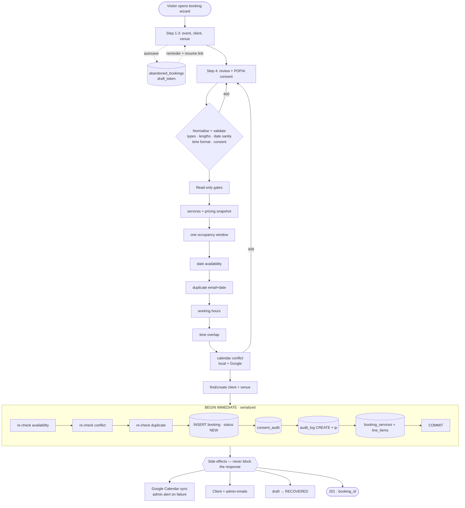

# Phase 1 — Booking Request Intake: Architecture, QA & Optimisation Review

**Scope:** `POST /api/public/bookings` (server.js), the booking wizard in `index.html` / `js/myscript.js`, and the `bookings` / `clients` / `venues` / `consent_audit` / `audit_log` / `abandoned_bookings` tables.
**Date:** 2026-07-09
**Method:** static review of the implementation, schema inspection against the live `database.sqlite`, and behavioural testing of the endpoint against a running server — each defect reproduced on the pre-fix build and re-tested after the fix.

---

## 1. Assessment of the current workflow

The reference diagram describes five sequential steps. **The implementation is materially more advanced than the diagram suggests**, and most of the automation an analyst would normally recommend is already built:

| Capability | Diagram | Reality |
|---|---|---|
| Multi-step form | not shown | 4-step wizard with progress bar |
| Draft autosave | not shown | debounced autosave + `navigator.sendBeacon` on exit |
| Resume abandoned booking | not shown | `abandoned_bookings` + `resume_token` links |
| Abandoned-booking reminders | not shown | scheduled reminder + purge jobs, opt-out link |
| Duplicate detection | not shown | pre-submit lookup + server-side `(email, date)` rule |
| Real-time validation | not shown | `blur` handlers on name/email/cell/location/event |
| Contact prefill | not shown | prefills from last consented booking |
| Consent audit | "Validated" | dedicated immutable `consent_audit` table |
| Audit trail | not shown | `audit_log` CREATE row per booking |
| Calendar sync | "calendar sync" | Google Calendar insert + admin alert on failure |
| Availability | one box | `date_holds` + standalone `events` + bookings + Google free/busy |

So the honest conclusion is: **Phase 1 does not need more automation. It needs correctness.** The steps in the diagram are all necessary, none is redundant, and the sequence is sound. What the review found instead is a cluster of defects in *how* those steps execute — several of which silently destroy bookings.

The one structural change worth making, and the one I made, is to **reorder** the steps so that every rejection happens before the first database write.

### Current sequence (pre-fix)

```
validate → check availability → duplicate check → working hours → time overlap
   → CREATE CLIENT + CREATE VENUE          ← first writes
   → validate services (can reject!)       ← leaves orphans behind
   → lead-time / per-day / quantity rules  ← leaves orphans behind
   → calendar conflict (can reject!)       ← leaves orphans behind
   → BEGIN IMMEDIATE → insert → COMMIT
   → side effects
```

### Optimised sequence (implemented)

```
normalise + validate  (types, lengths, date sanity, time format, consent)
   → validate services + snapshot pricing        ┐
   → compute ONE occupancy window                │ read-only.
   → date availability                           │ no writes.
   → duplicate (email, date)                     │ any rejection here
   → working hours                               │ costs nothing.
   → time overlap                                │
   → calendar conflict (local + Google)          ┘
   → find/create client + venue                  ← first writes
   → withDbTransaction:
        BEGIN IMMEDIATE
        re-check availability / conflict / duplicate under the lock
        insert booking + consent_audit + audit_log + services + line items
        COMMIT
   → side effects (calendar, emails, draft→recovered) — never block the response
```

---

## 2. Bugs identified and fixed

Every row below was reproduced on the pre-fix build. "Evidence" is the observed pre-fix behaviour.

### B1 — Concurrent bookings were lost with HTTP 500 *(critical)*

`node-sqlite3` multiplexes all requests over a **single connection**, and a transaction is a property of the connection, not the request. A second `BEGIN IMMEDIATE` issued while another request's transaction is open fails outright, and the handler mapped that to a generic 500.

**Evidence.** Eight simultaneous submissions from eight *distinct* clients on eight *distinct* dates — no business reason to reject any of them:

```
pre-fix:   1 × 200, 7 × 500 "Database error while saving booking."   → 1 booking persisted
post-fix:  8 × 200                                                    → 8 bookings persisted
```

Seven leads were dropped with no row in `bookings`, no `abandoned_bookings` draft, and nothing in the logs beyond `Status: 500`. The client saw "Database error while saving booking."

A second, worse consequence of the same root cause: statements from an *unrelated* request that interleave with an open transaction get swept into it, and are discarded by its `ROLLBACK`.

**Fix.** Guarded transactional sections queue behind `withDbTransaction()`, making `BEGIN → COMMIT/ROLLBACK` atomic with respect to other guarded sections. The transaction body was rewritten promise-first (`dbRun` / `dbGet`) so `ROLLBACK` and the queue slot are released on every exit path, including throws. Retested at 8-way concurrency across 5 rounds.

> The public booking intake is the **first** site migrated onto this helper. There are ~10 other `BEGIN TRANSACTION` sites in `server.js` with the same exposure — see the roadmap.

### B2 — Bookings could be created in the past *(high)*

`event_date` was format-checked (`YYYY-MM-DD`) but never compared to today. The only date sanity check in the handler was the **per-service lead time**, and that check is skipped entirely when `booking_lead_time_days = 0` — true for 13 of 30 rows in `services`, 4 of them active and bookable.

**Evidence.** A booking dated `2020-01-01` returned `200 {"success":true}` and was persisted.

**Fix.** Reject past dates, impossible dates (`2026-02-31`), and dates more than 5 years out.

### B3 — Rejected submissions left orphan `clients` and `venues` rows *(high)*

`findOrCreateClient()` and `findOrCreateVenueFromPlace()` ran *before* service validation, lead-time, per-day, quantity and calendar-conflict checks. Each of those gates returns 400/409 with no cleanup.

This matters more than it looks: `clients.email` is `UNIQUE`, so a junk row created by a rejected submission **permanently occupies that email**, and the next legitimate signup from the same address silently binds to it.

**Evidence.** Six rejected submissions → `clients` 46 → 51, `venues` 44 → 45.

**Fix.** All read-only gates now run before the first write.

### B4 — Duplicate `(email, date)` rule was not enforced under the lock *(medium)*

The `(email, date)` duplicate check ran before `BEGIN IMMEDIATE` but was never repeated inside it. The in-lock re-check that *did* exist (`hasCalendarConflict`) skips rows with a `NULL event_start_time`, so two concurrent **untimed** submissions for the same date could not collide there.

**Note on evidence:** I could not force a double-insert — Node's single thread plus SQLite's write lock make the window narrow, and in practice the collision surfaced as B1's 500 instead. The window is real by inspection; the re-check closes it deterministically. Post-fix, 8 concurrent identical submissions yield exactly `1 × 200, 7 × 409` and one persisted row.

### B5 — A database read error was reported as "date no longer available" *(medium)*

`checkDateAvailability()` calls back with `(err)` and **no result**. The pre-lock caller did `resolve(result)` and then read `.available` off `undefined`. The in-lock caller did `resolve(r || { available: false })` — turning a transient `SQLITE_BUSY` into a hard "the selected date is no longer available", sending a client away from a date that is in fact free.

**Fix.** Read failures and unavailable dates are now distinct: `503` ("we couldn't confirm availability, try again") vs `409`.

### B6 — `event_start_time` was never validated *(medium)*

The value flowed unchecked into `moment()`, `addMinutesToTime()` and the working-hours gate. `"abc"` produced `"NaN:NaN"` end times and an Invalid-date ISO conversion.

**Evidence.** `event_start_time: "abc"` returned `200` and was stored.

**Fix.** Must match `HH:MM` (24-hour); zero-padded on write, so `"9:00"` and `"09:00"` no longer compare differently.

### B7 — Non-string JSON values crashed the handler *(medium)*

`name.trim()`, `cell.replace()` and `message.trim()` were called before any type check.

**Evidence.** `{"name": ["a","b"]}` → `500 name.trim is not a function`.

**Fix.** All free-text fields are coerced and trimmed once, up-front; non-scalars collapse to `''` and fall through to the required-field check as a clean 400.

### B8 — No length cap on 17 free-text columns *(medium, availability)*

`message` was capped at 2000 characters. `company`, `event_name`, `event_location`, `venue_address`, `city`, `country`, `venue_type`, `event_type`, `audience_size`, `audience_demographic`, `budget_range`, `performance_slot`, `performance_duration`, `vat_number`, `policy_version`, `source` and `referrer` were not, and SQLite `TEXT` has no length constraint. A single request could write megabytes.

**Fix.** Per-column caps enforced before the first write.

### B9 — The working-hours gate and the stored end time used different durations *(medium)*

Working hours were validated against the **form's** `performance_duration`; `performance_end_time` — the value every *later* booking is conflict-checked against — was computed from the **service catalogue** duration. A booking could pass the gate and then persist an end time outside working hours.

**Evidence.** Form duration 90 min → stored `performance_end_time` was `11:00` (120-min default), not `10:30`.

**Fix.** One occupancy window, `max(catalogue, form)`, drives the gate, the conflict window and the stored end time.

### B10 — `performance_start_time` was left NULL on timed bookings *(low)*

Only the `performance_slot` branch wrote `performance_start_time`. Both `event_start_time` branches wrote `performance_end_time` alone.

**Evidence.** A booking with `event_start_time: "9:00"` persisted `performance_start_time = NULL`, `performance_end_time = "11:00"`.

### B11 — `travel_accommodation` stored NULL instead of 0 *(low)*

`travel_accommodation || null` turns `false` into `NULL` on a `BOOLEAN DEFAULT 0` column.

### B12 — `audit_log.ip_address` was NULL for every public submission *(low, compliance)*

The column exists and was never populated on the intake path. Now stamped from `req.ip`.

---

## 3. Gaps and weaknesses — found, **not** fixed

These are reported rather than changed: each either touches financial reporting semantics, crosses into another phase, or is a schema migration that deserves its own change window.

### G1 — Unquoted enquiries inflate outstanding revenue

Intake writes `amount_outstanding = calculatedBaseScope` on a `NEW` booking that has never been quoted. `server.js:11524` computes all-time outstanding as:

```sql
SELECT COALESCE(SUM(amount_outstanding), 0) AS total_outstanding
FROM bookings WHERE status NOT IN ('CANCELLED', 'EXPIRED')
```

So every unquoted enquiry is counted as receivable. Impact is currently muted because `base_price` is `NULL` for most `flat_fee` services (→ 0), but a `per_hour` service such as *MC & Host – Hourly Rate* (R2 950) adds its full estimate to "outstanding" the moment someone submits a form.

**Recommendation:** either exclude `NEW`/`PENDING` from the outstanding aggregate, or leave `amount_outstanding = 0` until a quote is issued. Coordinate with the financial-audit workstream before changing.

### G2 — `quote_amount` is a formatted string

`quote_amount` is `TEXT` and intake writes `"R 1234.00"`. Currency belongs in an integer-cents or `REAL` column with formatting at the presentation layer.

### G3 — `bookings.status` has no `CHECK` constraint, and the column default contradicts the code

`status TEXT DEFAULT 'pending'` (lowercase) while every code path writes uppercase (`NEW`, `QUOTED`, …). No constraint prevents a typo'd status from being written. This is the same class of defect already catalogued for `notifications.status` and `payment_method`.

### G4 — Missing indexes

* `booking_services(booking_id)` — **no index at all**, despite `ON DELETE CASCADE` from `bookings`.
* The duplicate check filters on `lower(email)`, which cannot use `idx_bookings_email` on `bookings(email)`. It is a full scan today (46 rows). Add `CREATE INDEX idx_bookings_email_lower_date ON bookings(lower(email), date)`.
* `bookings(created_at)` for the intake-volume analytics queries.

### G5 — `policy_version` is client-supplied

The browser tells the server which privacy-policy version the user consented to, and that value is written verbatim into `bookings.policy_version` **and** `consent_audit.policy_version`. A stale cached page — or a crafted request — records consent against the wrong policy text. For POPIA defensibility the server should stamp its own current version and ignore the client's.

### G6 — Conflict detection fails open

`hasCalendarConflict()` resolves `false` on a database error, on a Google API error, and in its outer `catch`. A read failure therefore *permits* a double-booking. That is a deliberate availability-over-safety trade-off, but it is undocumented and unmonitored — a failing Google credential silently degrades conflict detection to local-only, which is exactly what the running instance is doing right now (`No access, refresh token, API key or refresh handler callback is set`).

### G7 — Untimed bookings are asymmetric

A submission with no `event_start_time` is conflict-probed against a phantom `18:00` window, but once stored it has `event_start_time = NULL` and `hasCalendarConflict()` skips it — so it never blocks anyone else. An all-day booking does not hold its day.

### G8 — Two duration parsers with different fallbacks

`parseDurationMins()` (line 26) defaults to **60**; `parseDurationToMinutes()` (line 533) defaults to **120**. The first drives billable quantity, the second drives scheduling. A `per_minute` service submitted without a duration is billed for 60 minutes and scheduled for 120.

### G9 — `services.valid_from` / `valid_to` are never checked

The columns exist. Intake validates `is_active` and `is_deleted` but not the validity window, so a service outside its window is bookable.

### G10 — No timezone model

Every `moment()` call parses in server-local time. There is no timezone column on `bookings` or `venues`. A booking for an international venue (the catalogue has *Travel Buyout – International*) is stored and conflict-checked in the server's timezone.

### G11 — Draft autosave is weakly rate-limited

`POST /api/public/bookings/draft` uses only `ipRateLimiter` (100/hr) by design, so debounced autosaves aren't blocked. But `abandoned_bookings.draft_token` is client-generated, so one IP can create 100 draft rows per hour, each holding an email address. The 30-day purge bounds it, but a dedicated per-token limit would be better.

### G12 — The consent audit trail has integrity problems in the existing data

The `consent_audit` table is the artefact you would hand a regulator. Its current state:

* **24 of 41** bookings with `popia_consent = 1` have **no** `consent_audit` row.
* **18 of 35** `consent_audit` rows point at a `booking_id` that no longer exists in `bookings`.

The current code writes the consent row unconditionally inside the booking transaction, so new bookings are covered. These are legacy rows — but note that `consent_audit` declares `FOREIGN KEY (booking_id) REFERENCES bookings(id)` with no `ON DELETE` action, and `database.js` sets `PRAGMA foreign_keys = ON`. Deleting a booking that has a consent row should therefore have been *rejected*. That 18 orphans exist means either they predate FK enforcement, or something deletes bookings with foreign keys disabled. Worth establishing which before the next compliance review, because the same path would silently break any other audit relationship.

**Recommendation:** backfill what can be reconstructed, document the rest as pre-audit-table records, and add `ON DELETE RESTRICT` explicitly so the intent is visible in the schema.

---

## 4. Optimised workflow



The change from the original: **one write boundary**, everything cheap and rejectable happens to the left of it, and everything that can fail without invalidating the booking happens to the right of it.

---

## 5. Automation opportunities

Already automated (verified in code): booking creation, duplicate detection, availability, conflict detection, booking-number generation, status defaulting, calendar creation, client + admin email, CRM upsert (`clients`), audit logging, consent recording, analytics capture, abandoned-booking detection, follow-up reminders.

Genuinely missing:

| Opportunity | Value | Notes |
|---|---|---|
| Server-authoritative `policy_version` | compliance | see G5 |
| Outbox for side effects | reliability | calendar sync + email are fire-and-forget; a crash between COMMIT and dispatch loses the notification permanently. Persist an intent row, drain with a worker. |
| Idempotency key on submit | correctness | a double-tap or retry currently relies on the `(email, date)` rule; an explicit `Idempotency-Key` header would make retries safe |
| `valid_from`/`valid_to` enforcement | correctness | see G9 |
| Structured intake metrics | ops | count 400/409/500 by reason; today a 500 is invisible |

Event-driven rework of the rest is not justified at this volume (46 bookings lifetime). The outbox is the one pattern worth adopting now, because it fixes a real data-loss path rather than an imagined scaling one.

---

## 6. UX / UI improvements

The wizard is in good shape: 4 steps, autosave, resume, prefill, blur-level validation, focus-on-first-error. Concrete gaps found in the markup (24 form controls inside `#dedicatedBookingForm`):

| Finding | Count | Fix |
|---|---|---|
| `autocomplete` attributes | 1 of 24 | add `name`, `email`, `tel`, `organization`, `address-level2`, `country-name` |
| `inputmode` attributes | 0 | `inputmode="tel"` / `"numeric"` on phone and audience-size |
| Error text tied to its field | 0 `aria-describedby` | link each message to its input |
| `#bookingFormError` announced | not a live region | `role="alert"` |

Beyond attributes:

* **Reduce required fields.** 12 of 24 controls are `required`. `event_name`, `audience_demographic` and `budget_range` are qualification data, not intake data — collect them on the quote request instead.
* **`message` minimum of 10 characters** is friction on a form that already captures event type, date, venue, audience and services. Consider making it optional.
* **The duplicate 409 is a dead end.** It returns `existing_id`; the UI should offer "track that booking" as a button, not prose.
* **Smart defaults.** `country` should default from the venue's Google Place result rather than being asked.

---

## 7. Backend improvements

Implemented: input normalisation, type coercion, length caps, date and time validation, gate reordering, transaction serialisation, error-class separation (503 vs 409), audit IP capture.

Recommended: server-authoritative `policy_version` (G5); an explicit `409` body discriminator (`reason: "duplicate" | "unavailable" | "conflict"`) so the client can branch without string-matching the message; migrate the remaining `BEGIN TRANSACTION` sites onto `withDbTransaction()`.

Note that `POST /api/admin/bookings` (server.js:8616) shares this endpoint's shape — including the `BEGIN IMMEDIATE` on the shared connection at line 8752. It has the same B1 exposure and should be migrated next.

---

## 8. Database improvements

```sql
-- G4: the duplicate check cannot use idx_bookings_email because of lower()
CREATE INDEX IF NOT EXISTS idx_bookings_email_lower_date ON bookings(lower(email), date);

-- G4: no index at all on the cascade child
CREATE INDEX IF NOT EXISTS idx_booking_services_booking ON booking_services(booking_id);

-- G4: intake-volume analytics
CREATE INDEX IF NOT EXISTS idx_bookings_created_at ON bookings(created_at);

-- audit lookups by record
CREATE INDEX IF NOT EXISTS idx_audit_log_record ON audit_log(table_name, record_id);
```

Schema changes deserving a migration: a `CHECK` constraint on `bookings.status` with the default corrected to `'NEW'` (G3); `quote_amount` moved off `TEXT` (G2); a `timezone` column on `venues` (G10); a foreign key from `abandoned_bookings.converted_booking_id` to `bookings(id)`.

---

## 9. API improvements

* `POST /api/public/bookings` returns `200`; a resource-creating call should return `201` with a `Location` header. *(Not changed — would break the existing client, which checks `result.success`.)*
* The 409 responses are distinguishable only by message text. Add a machine-readable `reason`.
* `booking_id` is returned but no `resume`/`track` token, so the client cannot deep-link the confirmation.

---

## 10. Performance

At 46 lifetime bookings, nothing here is slow. The relevant observations are about *shape*, not speed:

* The Google free/busy call is on the critical path, with a 1500 ms timeout, before the transaction. It is correctly skipped inside the lock (`skipGoogle=true`) so no network round-trip is held under `BEGIN IMMEDIATE`.
* `withDbTransaction()` serialises guarded sections. The booking transaction contains no network calls, so the queue drains at local-write speed. This is a correctness win, not a throughput cost.
* The duplicate check is a full table scan (G4).

---

## 11. Security improvements

* **Fixed:** unbounded free-text writes (B8); type-confusion 500s (B7); orphan `clients` rows squatting a `UNIQUE` email (B3).
* **Fixed:** `source` and `referrer` were written to the database raw and unencoded. Both are now passed through `encodeUserHtml()` like every other client-supplied string, since the admin panel renders these fields via `innerHTML`.
* **Open:** `policy_version` is client-controlled and lands in the consent audit trail (G5).
* **Open:** conflict detection fails open on error (G6).
* Rate limiting on the endpoint (`5 / 15 min` per IP, plus a 100/hr IP limiter) is reasonable.

---

## 12. Accessibility (WCAG 2.2 AA)

| Criterion | Status |
|---|---|
| 1.3.1 Info and Relationships | labels present (20), but no `fieldset`/`legend` grouping the four steps |
| 1.3.5 Identify Input Purpose | **fails** — 1 `autocomplete` across 24 controls |
| 3.3.1 Error Identification | partial — errors shown visually, `#bookingFormError` is not a live region |
| 3.3.2 Labels or Instructions | passes |
| 3.3.3 Error Suggestion | passes — messages are specific and actionable |
| 4.1.3 Status Messages | **fails** — no `role="alert"` on the error container |

The step bar already carries `aria`/`role` attributes, and focus is moved to the first invalid field on submit — both good.

---

## 13. Prioritised roadmap

### Quick wins — done in this change

1. Transaction serialisation (B1) — the single highest-value fix.
2. Past-date guard (B2).
3. Gate reordering to eliminate orphan rows (B3).
4. In-lock duplicate re-check (B4).
5. Availability read-error vs unavailable-date separation (B5).
6. `event_start_time` validation and zero-padding (B6).
7. Type coercion (B7) and length caps (B8).
8. Unified occupancy window (B9); `performance_start_time` (B10); `travel_accommodation` (B11); audit IP (B12).
9. `source` / `referrer` output-encoding.

### Medium priority — next change window

10. Migrate `POST /api/admin/bookings` and the ~10 other `BEGIN TRANSACTION` sites onto `withDbTransaction()`. **Until this is done, an admin creating a booking concurrently with a public submission can still collide.**
11. Server-authoritative `policy_version` (G5).
12. The four indexes in §8.
13. Accessibility: `autocomplete`, `inputmode`, `role="alert"`, `aria-describedby`.
14. `409` reason discriminator + "track that booking" button on the duplicate path.
15. Decide the `amount_outstanding`-on-`NEW` question with the financial-audit workstream (G1).

### Long-term

16. Outbox table for calendar + email side effects; drain with the existing scheduled-job infrastructure.
17. `CHECK` constraint on `bookings.status`; `quote_amount` off `TEXT`.
18. Timezone model on `venues` (G10).
19. Reconcile the two duration parsers (G8).
20. An automated test suite. `package.json` currently has `"test": "echo \"Error: no test specified\" && exit 1"`. Every defect in §2 is cheaply expressible as an HTTP-level test; the harness used for this review is a starting point.

---

## AI & smart features — assessment

The prompt asks for automatic event categorisation, suggested durations, suggested pricing, venue validation, intelligent conflict resolution, predictive availability, lead scoring.

**None of these should be built yet**, and the reason is in the data: 46 lifetime bookings, of which 19 are `EXPIRED` and 11 `COMPLETED`. There is no signal to learn from. Lead scoring on 30 non-expired examples will encode noise, and a suggested-pricing model would be fitting a curve to a catalogue that already has explicit `base_price` values.

Two of the listed items are worth doing as **rules, not models**, today:

* **Venue validation** — already half-built. `venuePlaceId` is captured from Google Places; validate it server-side against the Places API rather than trusting the client's `event_location` string.
* **Suggested durations** — the catalogue already carries `performance_length_minutes` and `setup_time_minutes`. Surface them in the wizard as a default duration instead of asking the client to type one. This directly removes the `parseDurationToMinutes` ambiguity in G8.

Revisit the ML-shaped items at ~500 bookings.

---

## Effort estimates

I can only honestly quantify what I measured.

**Measured:** concurrent-submission success rate went from **1 of 8 to 8 of 8**. On a form that receives simultaneous submissions — which is exactly what happens after a broadcast appearance or a newsletter send — this is the difference between capturing a lead and losing it with a database error.

**Estimated, not measured:**

* *Client clicks:* dropping `event_name`, `audience_demographic` and `budget_range` from required removes ~3 interactions from a ~24-control form. Defaulting `country` from the Places result removes one more.
* *Administrator actions:* unchanged by this work. Phase 1 already requires zero admin action to capture a booking.
* *Processing time:* unchanged. The endpoint was never slow; it was wrong.
* *Manual intervention:* the orphan-row fix (B3) removes a recurring, invisible clean-up task from the `clients` table — one that nobody knew existed.

---

## Compliance & compatibility statement

* **Business rules preserved.** No rule was relaxed. Two were tightened, both with cause: the working-hours gate now uses the longer of the catalogue and form durations (B9), and past dates are rejected (B2). Same-client multi-booking on the same day remains allowed.
* **Backward compatible.** The request and response shapes are unchanged. `200` is retained on success. No column was dropped or renamed.
* **POPIA.** Consent remains mandatory; `consent_audit` is still written inside the transaction, so a booking can never exist without its consent record. `audit_log.ip_address` is now populated. One open item: `policy_version` should be server-stamped (G5).
* **Auditability.** The `audit_log` CREATE row now records the normalised values actually persisted, rather than the raw request body.
